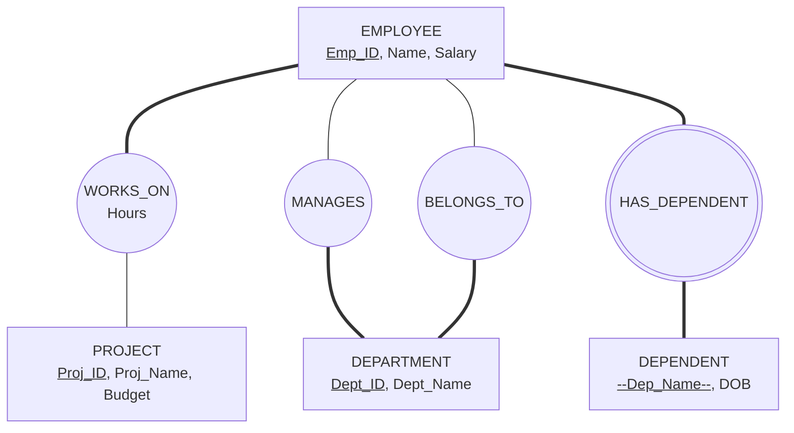
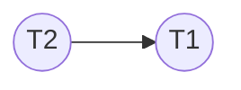
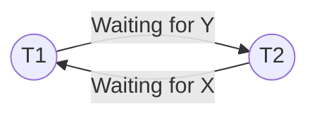
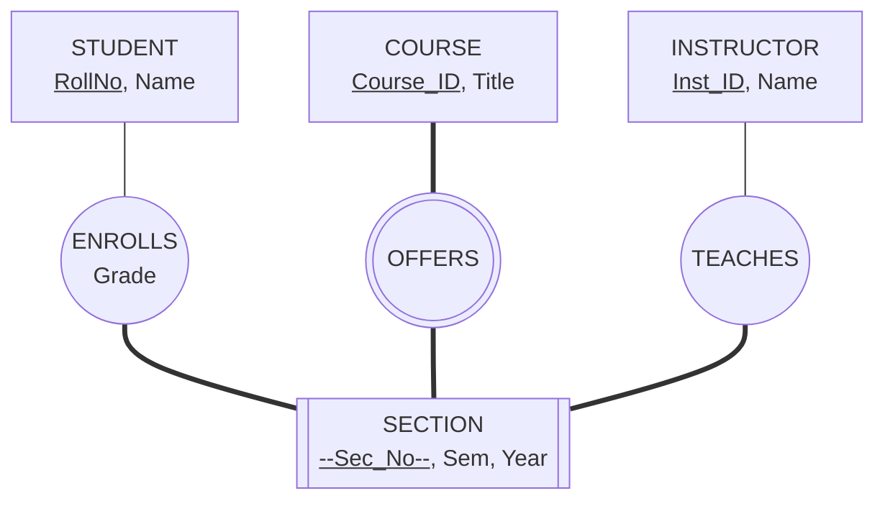
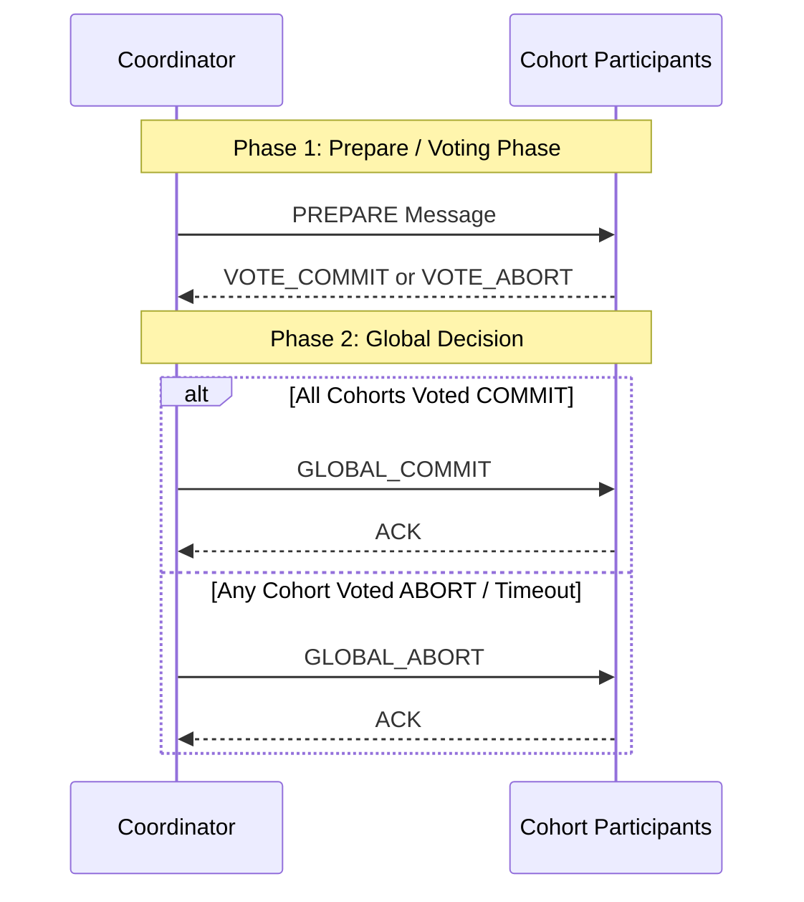
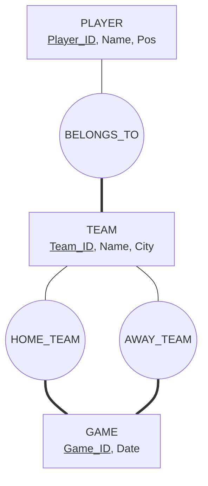
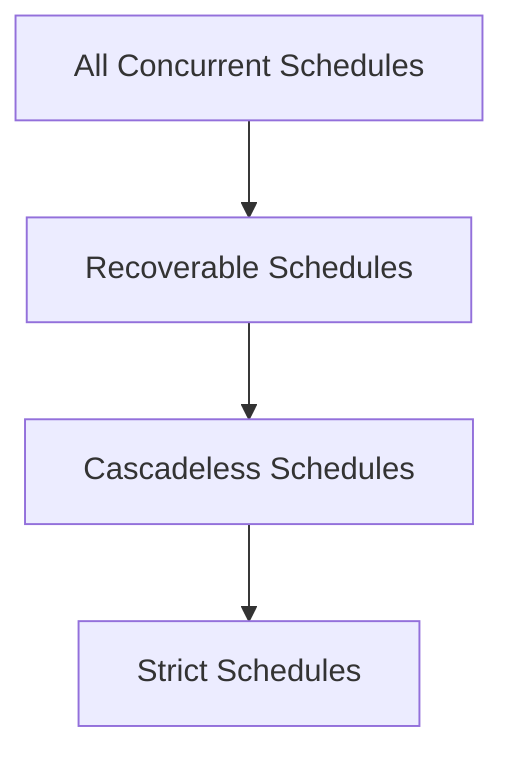
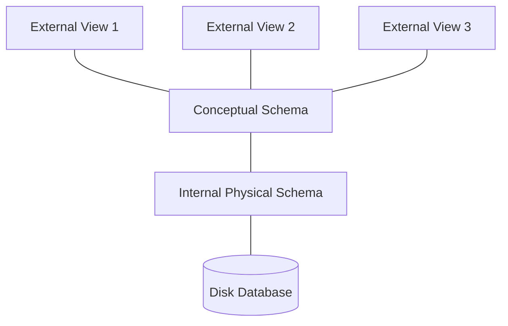
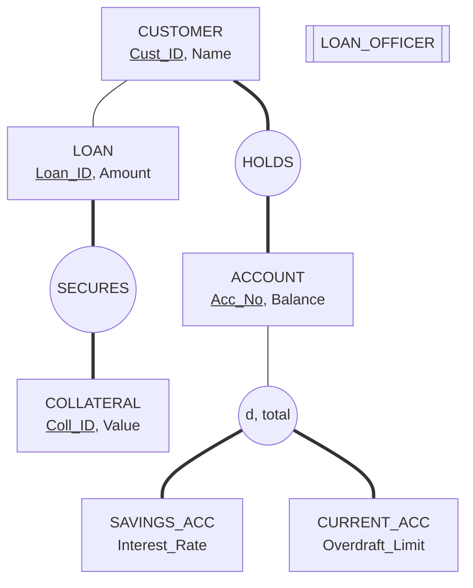

# BCS501: Database Management System — Master Question Bank Solutions

> **Course:** BCS501 (DBMS)  
> **Target Audience:** Engineering Students & Competitive Exam Aspirants  
> **Coverage:** All 57 2-Mark Short Questions & All 82 7-Mark Comprehensive Numerical & Analytical Problems.

---

# DBMS Question Bank Solutions (BCS501)

## 2 MARKS QUESTIONS

### Q1. What is Data Independency in DBMS?
Data independence is the capacity to modify a schema definition at one level of the three-schema database system without requiring alteration to the schema definition at the next higher level. It isolates application programs and user queries from modifications to the underlying logical data structures or physical storage mechanisms.

### Q2. Write the difference between DDL and DML.
| Feature | Data Definition Language (`DDL`) | Data Manipulation Language (`DML`) |
| :--- | :--- | :--- |
| **Primary Scope** | Defines, alters, and drops database schema structures and objects. | Queries, inserts, updates, and deletes stored data records. |
| **Examples & State** | `CREATE`, `ALTER`, `DROP`, `TRUNCATE` (Auto-committed; alters catalog). | `SELECT`, `INSERT`, `UPDATE`, `DELETE` (Requires explicit `COMMIT`/`ROLLBACK`). |

### Q3. What are different Integrity Constraints?
Integrity constraints are declarative assertions enforced by the DBMS to ensure data accuracy and consistency:
1. **Domain Constraints:** Restrict attribute values to valid data types, ranges, or enumerated sets (e.g., `CHECK(Age >= 18)`).
2. **Key Constraints:** Enforce uniqueness of candidate keys such that $\forall t_1, t_2 \in r, t_1[K] = t_2[K] \implies t_1 = t_2$.
3. **Entity Integrity:** Mandates that primary key attributes cannot contain `NULL` values ($\forall t \in r(R), t[PK] \neq \text{NULL}$).
4. **Referential Integrity:** Enforces valid foreign key references between child and parent tables ($FK \in R_1 \subseteq PK \in R_2$).

### Q4. Explain different Features of SQL.
SQL (Structured Query Language) is a comprehensive, declarative, non-procedural language for relational databases featuring unified DDL, DML, DCL, and TCL syntax. It provides built-in aggregation, set-oriented querying, relational joins, view definitions, constraint enforcement, and transactional ACID boundary control.

### Q5. What are advantages of normalization?
Normalization decomposes complex relations into smaller, well-structured relations to eliminate insertion, deletion, and modification anomalies. It minimizes uncontrolled data redundancy, preserves functional dependencies, ensures lossless join reconstructions, and optimizes storage utilization.

### Q6. Write different Inference Rule for Functional Dependency?
Armstrong's primary axioms are:
- **Reflexivity:** If $Y \subseteq X$, then $X \to Y$.
- **Augmentation:** If $X \to Y$, then $XZ \to YZ$ for any $Z$.
- **Transitivity:** If $X \to Y$ and $Y \to Z$, then $X \to Z$.
Secondary derived rules include Union ($X \to Y \land X \to Z \implies X \to YZ$), Decomposition ($X \to YZ \implies X \to Y \land X \to Z$), and Pseudo-transitivity ($X \to Y \land \gamma Y \to Z \implies \gamma X \to Z$).

### Q7. What are ACID properties of Transaction?
A transaction must satisfy four fundamental properties:
- **Atomicity:** All operations execute completely or none do ("All-or-Nothing").
- **Consistency:** Execution preserves all declared database schema invariants.
- **Isolation:** Concurrent transactions execute without mutual interference.
- **Durability:** Committed state updates survive subsequent system crashes.

### Q8. What are various reasons for transaction failure?
Transactions fail due to: (1) **Logical/Internal errors** such as bad input, division by zero, or integrity constraint violations; (2) **System errors** including deadlocks, concurrency aborts, or resource exhaustion; and (3) **System crashes/hardware faults** such as OS failures, power outages, or disk head crashes.

### Q9. What are Concurrent Transactions?
Concurrent transactions are multiple database transactions whose execution lifetimes overlap in time, allowing their individual read and write operations to be interleaved across shared hardware resources to maximize throughput and minimize response latency.

### Q10. What is Lock in Transaction Management?
A lock is a concurrency control synchronization variable associated with a data item that regulates whether a transaction can access, read (Shared lock `S`), or write (Exclusive lock `X`) that item, preventing conflicting concurrent operations.

### Q11. Define the evolution of database.
Database systems evolved from flat-file systems (1960s) to navigational Hierarchical (Tree) and Network (CODASYL/Graph) models (1970s), then to Codd's Relational Model (RDBMS/SQL, 1980s), Object-Oriented/Object-Relational systems (1990s), and modern distributed NoSQL/NewSQL databases (2000s-present).

### Q12. Why Network Data model and Hierarchical Data model are little used now?
| Feature | Hierarchical / Network Models | Relational Model (`RDBMS`) |
| :--- | :--- | :--- |
| **Data Independence** | Low; queries require hardcoded physical pointer traversal. | High; declarative SQL abstracts all physical access paths. |
| **Schema Flexibility** | Rigid tree/graph structures; complex $M:N$ modeling. | Dynamic tables; simple $M:N$ handling via foreign keys. |

### Q13. Define aggregation with example.
Aggregation is an ER modeling abstraction that treats a relationship set (and its participating entity sets) as a single higher-level entity set, allowing it to participate in further relationships. 
*Example:* The relationship `Works_On(Employee, Project)` is aggregated into an entity to participate in `Requires(Works_On, Machinery)`.

### Q14. Name any five database systems?
1. Oracle Database (Oracle Corporation)
2. PostgreSQL (PostgreSQL Global Development Group)
3. MySQL (Oracle Corporation)
4. Microsoft SQL Server (Microsoft)
5. SQLite (D. Richard Hipp / Public Domain)

### Q15. What are different relational algebra operations?
- **Fundamental:** Selection ($\sigma$), Projection ($\pi$), Cartesian Product ($\times$), Set Union ($\cup$), Set Difference ($-$), Rename ($\rho$).
- **Derived / Extended:** Set Intersection ($\cap$), Theta Join ($\bowtie_\theta$), Natural Join ($\bowtie$), Division ($\div$), Left/Right/Full Outer Joins ($\leftouterjoin, \rightouterjoin, \fullouterjoin$).

### Q16. What is Boyce-Codd Normal Form in the DBMS?
A relation schema `R` is in Boyce-Codd Normal Form (`BCNF`) if, for every non-trivial functional dependency $X \to A$ holding on `R`, the determinant attribute set $X$ is a strict **Superkey** of `R`.

### Q17. What are serial, non-serial schedules?
| Schedule Type | Execution Mechanism | Concurrency & Isolation |
| :--- | :--- | :--- |
| **Serial Schedule** | Operations of each transaction execute consecutively without interleaving. | Zero concurrency; guaranteed serializable by definition. |
| **Non-Serial Schedule** | Operations of multiple concurrent transactions are interleaved in time. | High throughput; requires serializability protocols. |

### Q18. What is the significance of Physical Data Independence?
Physical data independence permits modifying internal storage structures (e.g., building B+ tree indexes, reorganizing record layouts, altering disk partitioning) without requiring alterations to conceptual schemas, external views, or existing application code.

### Q19. List the four functions of DBA.
1. **Schema Definition & Modification:** Creating conceptual and physical schemas using DDL.
2. **Security & Authorization:** Managing user accounts, roles, and access privileges via DCL.
3. **Storage & Performance Tuning:** Configuring indexing, buffer pools, and disk layout.
4. **Backup & Disaster Recovery:** Implementing periodic backups and crash recovery protocols.

### Q20. When a relation set is called a recursive relationship set?
A relationship set is recursive (or unary) when the same entity set participates more than once in the relationship under different distinct structural roles (e.g., `EMPLOYEE` participates as `Supervisor` and `Supervisee` in the `MANAGES` relationship).

### Q21. What do you mean by currency with respect to database?
In database systems, "currency" refers either to the currency status of cursor/record pointers during low-level navigational traversal (e.g., current of record/set in DBTG), or to data freshness indicating that reads reflect the most recently committed updates without staleness.

### Q22. What is Relational Calculus?
Relational calculus is a formal, non-procedural, declarative query language based on first-order predicate logic where queries specify *what* data to retrieve rather than *how* to retrieve it. It exists as Tuple Relational Calculus (`TRC`) and Domain Relational Calculus (`DRC`).

### Q23. What is Equi-Join in database?
An Equi-Join is a theta join ($R \bowtie_\theta S$) whose join condition consists strictly of equality comparisons ($=$) between matching attributes of the participating relations (e.g., `R.A = S.A`), retaining all columns from both relations.

### Q24. What is a CLAUSE in terms of SQL?
A clause in SQL is a syntactic component of a statement that specifies an execution directive or condition. Major clauses include `SELECT` (projection), `FROM` (table specification), `WHERE` (tuple filtering), `GROUP BY` (aggregation partitioning), `HAVING` (group filtering), and `ORDER BY` (sorting).

### Q25. Define the closure of an attribute set.
The closure of an attribute set $X$ under a functional dependency set $F$, denoted $X^+$, is the set of all individual attributes in relation schema `R` that are functionally determined by $X$ ($X^+ = \{ A \mid F \vDash X \to A \}$).

### Q26. When is a transaction Rolled Back?
A transaction is rolled back when it aborts due to internal runtime errors (e.g., division by zero, constraint violation), explicit user cancellation (`ROLLBACK`), system deadlocks, or system crashes prior to reaching its commit point, restoring all modified items to their pre-transaction values.

### Q27. List the various levels of locking?
Locking granularity levels in a database hierarchy are:
1. **Database Level** (Entire database locked).
2. **Table / Relation Level** (Entire table locked).
3. **Page / Disk Block Level** (Physical storage block locked).
4. **Tuple / Row Level** (Individual record locked).
5. **Attribute / Column Level** (Specific field locked).

### Q28. Differentiate between physical and logical data independence.
| Dimension | Logical Data Independence | Physical Data Independence |
| :--- | :--- | :--- |
| **Level Modified** | Conceptual / Logical schema altered (e.g., adding attributes). | Internal / Physical schema altered (e.g., adding indexes). |
| **Ease of Achievement**| Harder; requires rewriting external-to-conceptual view mappings. | Easier; absorbed by conceptual-to-internal storage mapping. |

### Q29. List any four disadvantages of file system approach over database approach.
1. **Uncontrolled Data Redundancy & Inconsistency:** Duplication of identical data in multiple departmental files.
2. **Poor Data Isolation & Ad-Hoc Access:** Inability to write flexible queries without dedicated compiled code.
3. **Absence of Atomic Crash Recovery:** Partial updates left corrupted on disk during system crashes.
4. **Concurrent Access Anomalies:** Lack of coordinated row-level locking leading to lost updates.

### Q30. What is the difference between DROP and DELETE command?
| Feature | `DELETE` Command | `DROP` Command |
| :--- | :--- | :--- |
| **Classification** | DML operation; removes specific tuples matching `WHERE` clause. | DDL operation; completely removes table schema and data. |
| **Transaction State**| Can be rolled back; table structure and indexes remain intact. | Auto-committed; deallocates disk space and catalog entries. |

### Q31. List all prime and non-prime attributes In Relation R(A,B,C,D,E) with FD set F = {AB→C, B→E, C→D}.
Computing closure of LHS combinations:
$(AB)^+ = \{A, B, C, D, E\}$, $(A)^+ = \{A\}$, $(B)^+ = \{B, E\}$, $(C)^+ = \{C, D\}$.
The only candidate key is $\{A, B\}$.
- **Prime Attributes:** $\{A, B\}$
- **Non-Prime Attributes:** $\{C, D, E\}$

### Q32. Explain MVD with the help of suitable example.
A Multi-Valued Dependency ($X \twoheadrightarrow Y$) holds on `R(X, Y, Z)` if for a given value of $X$, the set of $Y$ values is completely independent of the set of $Z$ values.
*Example:* `COURSE(C_ID, Teacher, TextBook)` has `C_ID` $\twoheadrightarrow$ `Teacher` and `C_ID` $\twoheadrightarrow$ `TextBook`, forcing all combinations of teachers and books for each course.

### Q33. Discuss Consistency and Isolation property of a transaction.
- **Consistency:** Guarantees that if a transaction executes on a valid database state satisfying all constraints, it leaves the database in another valid state upon completion.
- **Isolation:** Ensures that the intermediate, uncommitted state modifications of a transaction remain completely invisible to all other concurrently executing transactions.

### Q34. Draw a state diagram and discuss the typical states that a transaction goesthrough during execution.
A transaction transitions through:
```
[Active] ---> [Partially Committed] ---> [Committed]
   |                     |
   V                     V
[Failed] ------------> [Aborted]
```
`Active` is the initial execution state; `Partially Committed` occurs after the final statement executes; `Committed` is reached after write-ahead log flush; `Failed` occurs on error; `Aborted` rolls back all changes.

### Q35. Discuss Conservative 2PL and Strict 2PL.
| Protocol | Locking Rule | Deadlock & Cascading Property |
| :--- | :--- | :--- |
| **Conservative 2PL** | Pre-acquires all required shared and exclusive locks before execution begins. | **Deadlock-Free**; requires knowing read/write sets in advance. |
| **Strict 2PL** | Normal growing phase, but holds **all Exclusive (X) locks** until Commit/Abort. | Prevents cascading aborts; strict recoverable schedules. |

### Q36. Describe how view serializability is related to conflict serializability.
Every conflict serializable schedule is also view serializable ($\text{Conflict Serializable} \subset \text{View Serializable}$). View serializability is a broader class that allows non-conflict-equivalent schedules containing "blind writes" ($W_i(X)$ without preceding $R_i(X)$) where final write orders produce identical read/write view states.

### Q37. Explain Logical data Independence.
Logical data independence is the ability to modify the conceptual schema (such as adding/deleting attributes, splitting tables, or modifying relationships) without requiring modifications to external views or existing application programs, accomplished by updating external-to-conceptual mappings.

### Q38. Write Advantages of Database.
1. Minimization and control of data redundancy across an organization.
2. Enforcement of centralized data integrity constraints and business rules.
3. Declarative ad-hoc querying and high-throughput concurrent access.
4. Robust backup, logging, and crash recovery subsystems.

### Q39. Define Relational Algebra.
Relational algebra is a theoretical, procedural formal query language consisting of a closed collection of operations that take one or two relational instances as input and evaluate to a new relational instance as output.

### Q40. Define constraint and its types in DBMS.
A constraint is a formal declarative rule enforced by the DBMS engine to preserve data validity and consistency. Types include: (1) Domain constraints (`CHECK`, `NOT NULL`), (2) Key constraints (`PRIMARY KEY`, `UNIQUE`), (3) Entity integrity constraints (no `NULL` in PK), and (4) Referential integrity constraints (`FOREIGN KEY`).

### Q41. Define 3 NF.
A relation schema `R` is in Third Normal Form (`3NF`) if it is in 2NF and, for every non-trivial functional dependency $X \to A$ on `R`, either $X$ is a **Superkey** of `R` OR $A$ is a **Prime Attribute** of `R`.

### Q42. What is serializability in transaction processing systems?
Serializability is the golden correctness criterion for concurrent transaction schedules. A schedule is serializable if its outcome (final database state and read values) is computationally equivalent to some non-interleaved serial execution of those same transactions.

### Q43. Define Shared lock.
A Shared Lock (denoted `Lock-S` or `S`) is a read-only concurrency lock. Multiple transactions can simultaneously hold shared locks on the same data item ($S \land S = \text{True}$), but no transaction can obtain an exclusive write lock while a shared lock is active.

### Q44. Define candidate key and super key with example.
- **Super Key:** Any attribute set that uniquely identifies tuples in a relation (e.g., `{Roll_No, Name}` in `STUDENT`).
- **Candidate Key:** A minimal super key from which no attribute can be removed without losing uniqueness (e.g., `{Roll_No}`).

### Q45. Differentiate TRUNCATE and DELETE command.
| Feature | `TRUNCATE` Command | `DELETE` Command |
| :--- | :--- | :--- |
| **Operation Type** | DDL; deallocates entire data pages at storage level. | DML; scans and deletes rows individually. |
| **Logging & Speed** | Minimal logging; extremely fast; cannot filter with `WHERE`. | Full transaction log per row; slower; supports `WHERE`. |

### Q46. Define triggers and its types.
A database trigger is a stored PL/SQL program unit automatically executed by the DBMS engine in response to a specific DDL or DML event (`INSERT`, `UPDATE`, `DELETE`). Types include: (1) **Row-Level** (`FOR EACH ROW`), (2) **Statement-Level**, (3) **BEFORE**, (4) **AFTER**, and (5) **INSTEAD OF** triggers.

### Q47. Analyze and find the FDs in the following relation X Y Z.
Assuming a relation instance `r(X, Y, Z)` where distinct values of `X` map to single values of `Y`, but `Y` maps to multiple `X`, the candidate FDs are verified by checking $\forall t_1, t_2 \in r, t_1[LHS] = t_2[LHS] \implies t_1[RHS] = t_2[RHS]$. If every unique $(X, Y)$ pair determines a unique $Z$, then $XY \to Z$.

### Q48. Define multiple granuality.
Multiple Granularity Locking (`MGL`) is a concurrency protocol that organizes database lockable items into a tree hierarchy (Database $\to$ Area $\to$ File $\to$ Page $\to$ Record), utilizing Intent Locks (`IS`, `IX`, `SIX`) at higher levels to allow coarse-grained and fine-grained locking without scanning whole trees.

### Q49. What is the concept of keys in database?
Keys are single attributes or combinations of attributes that establish unique entity identification, prevent duplicate records, enable efficient index-based retrieval, and enforce referential associations across relations in relational data modeling.

### Q50. What is strong & weak entity set?
| Entity Type | Identification & Primary Key | Participation in Relationship |
| :--- | :--- | :--- |
| **Strong Entity Set** | Has sufficient attributes to form its own Primary Key independently. | Can have partial or total participation. |
| **Weak Entity Set** | Lacks a primary key; uses Partial Key + Owner PK; double rectangle. | **Always Total Participation** in identifying relationship. |

### Q51. Explain referential integrity.
Referential integrity is a relational constraint dictating that any foreign key value in a referencing relation `R_1` must either match an existing primary key value in the referenced relation `R_2`, or be explicitly `NULL`.

### Q52. Explain entity integrity constraints.
Entity integrity is a fundamental relational rule stating that no attribute comprising the primary key of a base relation can accept `NULL` values ($\forall t \in r(R), t[PK] \neq \text{NULL}$), ensuring every entity instance remains uniquely addressable.

### Q53. Why do we normalize database?
We normalize databases to eliminate operational anomalies (insertion, deletion, and update anomalies), reduce data duplication and storage overhead, maintain dependency integrity, and ensure clean relational decomposition.

### Q54. What do you mean by testing of serializability?
Testing serializability is the algorithmic process of verifying whether a concurrent schedule is conflict serializable by constructing a directed **Precedence Graph (Serialization Graph)** and checking for the absence of directed cycles.

### Q55. Define replication in distributed database.
Replication in distributed databases is the storage of multiple identical copies of a relation or fragment across geographically distinct server sites to increase data availability, fault tolerance, and local read query performance.

### Q56. Define concurrency control.
Concurrency control is the database management subsystem responsible for coordinating simultaneous transaction executions on shared data to prevent data corruption, anomalies, and race conditions while guaranteeing ACID isolation.

### Q57. Define exclusive lock.
An Exclusive Lock (denoted `Lock-X` or `X`) is a write lock that grants a single transaction exclusive permission to both read and update a data item. No other transaction can hold any lock (`S` or `X`) on that item concurrently.


## 7 MARKS QUESTIONS (Part 1: Q1 to Q20)

---

### Q1. What is ER Diagram? Explain different Components of an ER Diagram with their Notation. Also make an ER Diagram for Employee Project Management System.

#### 1. Concept of ER Diagram
An **Entity-Relationship (ER) Diagram** is a high-level conceptual data modeling schematic introduced by Dr. Peter Chen (1976). It provides a graphical representation of the real-world enterprise mini-world by abstracting data into **Entities**, **Attributes**, and **Relationships**.

#### 2. Components of an ER Diagram & Notations
| Component | Geometric Chen Notation | Crow's Foot Notation | Technical Semantic |
| :--- | :--- | :--- | :--- |
| **Strong Entity Set** | Single Rectangle | Box with PK Header | Independent existence; possesses a distinct Primary Key. |
| **Weak Entity Set** | Double Rectangle | Box with FK Dependency | Existence-dependent on an owner entity; lacks independent PK. |
| **Relationship Set** | Single Diamond | Connecting Line | Associates two or more entities. |
| **Identifying Relationship** | Double Diamond | Embedded FK Line | Relates a weak entity set to its strong owner entity. |
| **Simple Attribute** | Single Oval | Column Entry | Indivisible atomic scalar value. |
| **Key Attribute** | Oval with Underlined Text | Primary Key (`PK`) marker | Uniquely identifies entity instances within a set. |
| **Multivalued Attribute** | Double Oval | Auxiliary Table | Can hold a set of values for a single entity instance. |
| **Derived Attribute** | Dashed Oval | Computed Column | Dynamically computed from stored attributes (e.g., `Age`). |
| **Composite Attribute** | Hierarchical Tree of Ovals | Flattened Sub-columns | Subdivided into smaller components (e.g., `Street, City`). |

#### 3. ER Diagram: Employee Project Management System


#### 4. Relational Schema Reduction:
- `EMPLOYEE(`<u>`Emp_ID`</u>`, Name, Salary, Dept_ID)`
- `PROJECT(`<u>`Proj_ID`</u>`, Proj_Name, Budget)`
- `DEPARTMENT(`<u>`Dept_ID`</u>`, Dept_Name, Mgr_Emp_ID)`
- `WORKS_ON(`<u>`Emp_ID, Proj_ID`</u>`, Hours)`
- `DEPENDENT(`<u>`Emp_ID, Dep_Name`</u>`, DOB)`

---

### Q2. What is Relational Algebra? Explain Different Operations of Relational Algebra with Example.

#### 1. Theoretical Definition
Relational Algebra is a theoretical procedural query language where operations take one or two relation instances as input and return a new relation instance as output.

#### 2. Fundamental Operations
1. **Selection ($\sigma_p(R)$):** Filters tuples satisfying propositional formula $p$.
   $$\sigma_{\text{Dept} = '\text{CSE}' \land \text{Salary} > 50000}(\text{EMPLOYEE})$$
2. **Projection ($\pi_L(R)$):** Extracts column subset $L$ and eliminates duplicate tuples.
   $$\pi_{\text{Name, Salary}}(\text{EMPLOYEE})$$
3. **Cartesian Product ($R \times S$):** Concatenates every tuple of $R$ with every tuple of $S$.
4. **Set Union ($R \cup S$):** Combines tuples from union-compatible relations $R$ and $S$.
5. **Set Difference ($R - S$):** Returns tuples in $R$ that are absent in $S$.
6. **Rename ($\rho_{S(A_1, \dots, A_n)}(R)$):** Renames relation $R$ to $S$ and its attributes to $A_1 \dots A_n$.

#### 3. Derived Operations
- **Theta Join ($R \bowtie_\theta S$):** $\sigma_\theta(R \times S)$.
- **Natural Join ($R \bowtie S$):** Equijoin over all identically named common attributes with duplicate removal.
- **Division ($R \div S$):** Formulates "for all" universal queries:
  $$R \div S = \pi_{R-S}(R) - \pi_{R-S}((\pi_{R-S}(R) \times S) - R)$$

#### 4. Concrete Example:
Given `STUDENT_COURSE(Roll, CID)` and `CORE_COURSES(CID)`:
$$\pi_{\text{Roll, CID}}(\text{STUDENT_COURSE}) \div \text{CORE_COURSES}$$
Returns only students registered for **every** core course.

---

### Q3. (i) What is highest normal form of the Relation R(W,X,Y,Z) with the set F={WY→XZ, X→Y} (ii) Consider a relation R(A,B,C,D,E) with set F={A→CD, C→B, B→AE} What are the prime attributes of this Relation and Decompose the given relation in 3NF.

#### Part (i): Normal Form of R(W,X,Y,Z) with F = {WY → XZ, X → Y}
1. **Attribute Closures & Candidate Key Analysis:**
   - $(WY)^+ = \{W, Y, X, Z\}$ (Since $WY \to XZ$, $WY$ derives all attributes).
   - $(WX)^+ = \{W, X, Y, Z\}$ (Since $X \to Y$, $WX \to WY \to XZ$).
   - Candidate Keys: $\{WY, WX\}$.
   - Prime Attributes: $\{W, X, Y\}$; Non-Prime Attribute: $\{Z\}$.
2. **Evaluation of Functional Dependencies:**
   - For $WY \to XZ$: $WY$ is a Candidate Key (Superkey) $\implies$ Satisfies BCNF and 3NF.
   - For $X \to Y$: $X$ is not a superkey; $Y$ is a prime attribute.
   - Since $X$ is a proper subset of Candidate Key $WX$, and $Y$ is prime, it does not violate 2NF (as 2NF prohibits partial dependencies on *non-prime* attributes).
   - For 3NF: In $X \to Y$, $Y$ is a **Prime Attribute**. Thus, 3NF is satisfied!
   - For BCNF: $X$ is NOT a superkey $\implies$ BCNF is violated.
3. **Verdict:** The highest normal form is **3NF (Third Normal Form)**.

---

#### Part (ii): Prime Attributes & 3NF Synthesis for R(A,B,C,D,E)
1. **Candidate Key Computation:**
   - $(A)^+ = \{A, C, D, B, E\} \implies A$ is a Candidate Key.
   - $(C)^+ = \{C, B, A, E, D\} \implies C$ is a Candidate Key.
   - $(B)^+ = \{B, A, E, C, D\} \implies B$ is a Candidate Key.
   - Candidate Keys: $\{A\}, \{B\}, \{C\}$.
   - **Prime Attributes:** $\{A, B, C\}$.
   - **Non-Prime Attributes:** $\{D, E\}$.

2. **Minimal Cover ($F_c$):**
   - Step 1 (Decompose RHS): $F_1 = \{A \to C, A \to D, C \to B, B \to A, B \to E\}$.
   - Step 2 (Extraneous test): No extraneous attributes found.
   - Step 3 (Redundancy test): All FDs are non-redundant. $F_c = F_1$.

3. **3NF Synthesis (Bernstein's Algorithm):**
   - Create tables for each FD:
     - $R_1(\underline{A}, C, D)$ from $A \to CD$ (Key: $A$)
     - $R_2(\underline{C}, B)$ from $C \to B$ (Key: $C$)
     - $R_3(\underline{B}, A, E)$ from $B \to AE$ (Key: $B$)
   - Since $R_1, R_2, R_3$ all contain candidate keys, no extra key table is needed.
4. **Final 3NF Decomposition:** $R_1(\underline{A}, C, D)$, $R_2(\underline{C}, B)$, $R_3(\underline{B}, A, E)$. (Lossless and Dependency Preserving).

---

### Q4. Explain the method of testing the serializability. Consider the schedule S1 and S2 given below S1: R1(A),R2(B), W1(A),W2(B) S2: R2(B),R1(A), W2(B), W1(A) Check whether the given schedules are conflict equivalent or not?

#### 1. Method of Testing Serializability
A concurrent schedule $S$ is conflict serializable if and only if its **Precedence Graph (Serialization Graph)** $G = (V, E)$ is an **Acyclic Directed Graph (DAG)**.
- **Nodes ($V$):** Transactions participating in the schedule.
- **Directed Edges ($E$):** An edge $T_i \to T_j$ is drawn if an operation $O_i \in T_i$ precedes $O_j \in T_j$, they operate on the same data item $Q$, and at least one is a Write operation ($R_i(Q)-W_j(Q), W_i(Q)-R_j(Q), W_i(Q)-W_j(Q)$).

#### 2. Analysis of Schedule S1 and S2:
- $S_1 = R_1(A), R_2(B), W_1(A), W_2(B)$
  - Conflicting pairs: None between $T_1$ and $T_2$ because $T_1$ operates exclusively on $A$ while $T_2$ operates exclusively on $B$.
  - Precedence Graph $G(S_1)$: Has nodes $T_1, T_2$ with **zero edges**.
  - Acyclic $\implies S_1$ is Conflict Serializable.

- $S_2 = R_2(B), R_1(A), W_2(B), W_1(A)$
  - Conflicting pairs: None between $T_1$ and $T_2$.
  - Precedence Graph $G(S_2)$: Has nodes $T_1, T_2$ with **zero edges**.
  - Acyclic $\implies S_2$ is Conflict Serializable.

#### 3. Conflict Equivalence Check:
Two schedules are conflict equivalent if:
1. They involve the same transactions and operations.
2. The relative order of every pair of conflicting operations is identical in both schedules.

Since there are **zero conflicting operations between $T_1$ and $T_2$**, no conflicting pair has its relative ordering reversed between $S_1$ and $S_2$. 
Therefore, **$S_1$ and $S_2$ are CONFLICT EQUIVALENT**.

---

### Q5. Explain the Validation Based protocol for concurrency control.

#### 1. Overview of Optimistic Concurrency Control (OCC)
Validation-based protocol assumes that data conflicts are rare in read-intensive environments. Transactions execute without locking, operating on local private workspace copies.

#### 2. Three Execution Phases
```
[ Read & Execution Phase ] ---> [ Validation Phase ] ---> [ Write Phase / Disk Flush ]
(Local Private Variables)        (Timestamp Validation)    (Commit Updates to DB)
```

1. **Read Phase:** Reads data from database into local transaction workspace. All updates and computations execute strictly on local copies.
2. **Validation Phase:** Validates whether committing the transaction violates serializability with concurrent transactions. If validation fails, the workspace is discarded and the transaction aborts.
3. **Write Phase:** If validated, local updates are permanently copied to disk storage.

#### 3. Validation Rules (Kung-Robinson Model)
Let $TS(T)$ be the timestamp when $T$ enters its validation phase. For all $T_i$ with $TS(T_i) < TS(T_j)$, validation succeeds if at least one condition holds:
- **Condition 1:** $T_i$ completes its Write phase before $T_j$ starts its Read phase:
  $$\text{FinishWrite}(T_i) < \text{StartRead}(T_j)$$
- **Condition 2:** $T_i$ completes its Write phase before $T_j$ starts its Write phase, and the write set of $T_i$ does not overlap the read set of $T_j$:
  $$\text{FinishWrite}(T_i) < \text{StartWrite}(T_j) \land (\text{WriteSet}(T_i) \cap \text{ReadSet}(T_j) = \emptyset)$$

---

### Q6. What is Data Abstraction? How the Data Abstraction is achieved in DBMS?

#### 1. Definition of Data Abstraction
Data abstraction is the design principle of suppressing complex, low-level physical storage and hardware details from database users to provide a clean, logical view of data.

#### 2. Levels of Abstraction (ANSI/SPARC Framework)
```
+-------------------------------------------------------------+
|    External Level (View 1) | View 2 | View 3 (User Views)   |
+-------------------------------------------------------------+
                              |
              [ External / Conceptual Mapping ]
                              V
+-------------------------------------------------------------+
|           Conceptual Level (Community Logical Schema)        |
+-------------------------------------------------------------+
                              |
              [ Conceptual / Internal Mapping ]
                              V
+-------------------------------------------------------------+
|           Internal Level (Physical Storage & Indexes)       |
+-------------------------------------------------------------+
```

1. **Physical / Internal Level:** Lowest level; describes how data is stored on disk (block sizes, B+ tree indexes, compression, record offsets).
2. **Logical / Conceptual Level:** Intermediate level; describes *what* data is stored in the database, relationships, entity types, and schema constraints.
3. **View / External Level:** Highest level; custom tailored subschemas exposing only relevant data subsets to specific user groups while hiding sensitive fields.

---

### Q7. Explain the following with example (i) Generalization (ii) Specialization (iii) Aggregation.

#### (i) Generalization (Bottom-Up Abstraction)
Generalization is the process of synthesizing common attributes of multiple lower-level entity sets into a higher-level superclass entity set.
*Example:* Combining `CAR(License_No, Max_Speed, Num_Doors)` and `TRUCK(License_No, Max_Speed, Payload_Tons)` into generalized superclass `VEHICLE(License_No, Max_Speed)`.

#### (ii) Specialization (Top-Down Abstraction)
Specialization is the process of defining distinctive subclasses from an entity superclass based on specific distinguishing characteristics.
*Example:* `EMPLOYEE(Emp_ID, Name)` specialized into `SALARIED_EMPLOYEE(Annual_Salary)` and `HOURLY_EMPLOYEE(Hourly_Rate)`.

#### (iii) Aggregation (Relationship as Higher-Level Entity)
Aggregation treats a relationship set (and participating entity sets) as a single composite entity set, enabling it to participate in further relationships.
*Example:* `EMPLOYEE` works on `PROJECT` via relationship `Works_On`. To record machinery assigned to that job, `(EMPLOYEE - Works_On - PROJECT)` is aggregated into a single entity, which then enters relationship `Uses` with `MACHINERY`.

---

### Q8. What is Aggregate Function in SQL? Write SQL query for different Aggregate Function.

#### 1. Definition
Aggregate functions evaluate multiple column values across grouped rows to return a single summarized scalar value.

#### 2. Core SQL Aggregate Functions & Queries
Given table `EMPLOYEE(Emp_ID, Name, Dept_ID, Salary)`:

```sql
-- 1. COUNT: Total count of rows and non-null values
SELECT COUNT(*) AS Total_Employees, COUNT(Dept_ID) AS Assigned_Dept_Count 
FROM EMPLOYEE;

-- 2. SUM: Total payroll expenditure
SELECT SUM(Salary) AS Total_Payroll FROM EMPLOYEE WHERE Dept_ID = 10;

-- 3. AVG: Average salary per department with filter
SELECT Dept_ID, AVG(Salary) AS Avg_Salary 
FROM EMPLOYEE 
GROUP BY Dept_ID 
HAVING AVG(Salary) > 60000;

-- 4. MIN and MAX: Salary bounds
SELECT MIN(Salary) AS Min_Sal, MAX(Salary) AS Max_Sal FROM EMPLOYEE;
```

---

### Q9. Explain Procedure in SQL/PL SQL.

#### 1. Definition
A PL/SQL Stored Procedure is a named, compiled executable block stored in the database catalog that can accept input (`IN`), output (`OUT`), and bidirectional (`IN OUT`) parameters to execute complex business workflows.

#### 2. Architecture & Code Implementation
```sql
CREATE OR REPLACE PROCEDURE ProcessBonus (
    p_dept_id IN NUMBER,
    p_percentage IN NUMBER,
    p_total_updated OUT NUMBER
) AS
BEGIN
    UPDATE EMPLOYEE
    SET Salary = Salary * (1 + (p_percentage / 100))
    WHERE Dept_ID = p_dept_id;
    
    p_total_updated := SQL%ROWCOUNT;
    COMMIT;
EXCEPTION
    WHEN OTHERS THEN
        ROLLBACK;
        p_total_updated := 0;
        RAISE_APPLICATION_ERROR(-20001, 'Error executing salary update');
END ProcessBonus;
/
```

---

### Q10. What is Functional Dependency? Explain the procedure of calculating the Canonical Cover of a given Functional Dependency Set with suitable example.

#### 1. Functional Dependency Definition
A functional dependency $X \to Y$ over schema `R` specifies that whenever two tuples agree on attribute set $X$, they must agree on attribute set $Y$ ($\forall t_1, t_2 \in r, t_1[X] = t_2[X] \implies t_1[Y] = t_2[Y]$).

#### 2. Canonical Cover ($F_c$) Algorithm
1. **Decomposition:** Transform every FD so RHS has a single attribute ($X \to Y_1 Y_2 \implies X \to Y_1, X \to Y_2$).
2. **Extraneous Attribute Removal:**
   - In $XA \to B$, attribute $A$ on LHS is extraneous if $B \in X^+_F$.
   - In $X \to AB$, attribute $A$ on RHS is extraneous if $A \in X^+_{F'}$ where $F' = (F - \{X \to AB\}) \cup \{X \to B\}$.
3. **Redundant FD Removal:** An FD $X \to A$ is redundant if $A \in X^+_{F - \{X \to A\}}$.

#### 3. Concrete Solved Example
Let $F = \{ A \to BC, B \to C, A \to B, AB \to C \}$.
- **Step 1 (Decompose RHS):** $F_1 = \{ A \to B, A \to C, B \to C, AB \to C \}$.
- **Step 2 (Extraneous test):** In $AB \to C$, compute $A^+_{F_1} = \{A, B, C\}$. Since $C \in A^+$, $B$ is extraneous on LHS $\implies AB \to C$ becomes $A \to C$. Set is $\{A \to B, A \to C, B \to C\}$.
- **Step 3 (Redundancy test):** In $\{A \to B, A \to C, B \to C\}$, test $A \to C$. Under $F' = \{A \to B, B \to C\}$, $A^+_{F'} = \{A, B, C\}$. Since $C \in A^+$, $A \to C$ is redundant and removed.
- **Canonical Cover:** $F_c = \{ A \to B, B \to C \}$.

---

### Q11. (i) Consider the relation R(a,b,c,d) with Set F={a→c, b→d}. Decompose this relation in 2 NF. (ii) Explain the Loss Less Decomposition with example.

#### Part (i): 2NF Decomposition of R(a,b,c,d)
1. **Candidate Key:** $(ab)^+ = \{a, b, c, d\} \implies$ Candidate Key is $\{a, b\}$.
2. **Prime Attributes:** $\{a, b\}$; **Non-Prime Attributes:** $\{c, d\}$.
3. **Anomaly Analysis:**
   - $a \to c$: Non-prime $c$ depends on proper subset $a$ of Candidate Key $\{a, b\}$ (Partial Dependency).
   - $b \to d$: Non-prime $d$ depends on proper subset $b$ of Candidate Key $\{a, b\}$ (Partial Dependency).
4. **2NF Decomposition:**
   - $R_1(\underline{a}, c)$ with FD $a \to c$.
   - $R_2(\underline{b}, d)$ with FD $b \to d$.
   - $R_3(\underline{a, b})$ with key $\{a, b\}$.

---

#### Part (ii): Lossless Join Decomposition
A decomposition of $R$ into $R_1$ and $R_2$ is **Lossless** if $R_1 \bowtie R_2 = R$.
**Theorem:** A binary decomposition is lossless if and only if:
$$(R_1 \cap R_2) \to R_1 \in F^+ \quad \text{OR} \quad (R_1 \cap R_2) \to R_2 \in F^+$$
*Example:* $R(A, B, C)$ with $A \to B$. Decomposed into $R_1(A, B)$ and $R_2(A, C)$.
$R_1 \cap R_2 = \{A\}$. Since $A \to B$ holds, $A \to R_1$ is satisfied $\implies$ **Lossless**.

---

### Q12. What is Conflict Serializable Schedule? Check the given Schedule S1 is Conflict Serializable or not? S1: R1(X), R2(X), R2(Y), W2(Y), R1(Y), W1(X).

#### 1. Definition
A schedule $S$ is conflict serializable if it can be transformed into a serial schedule by a series of non-conflicting adjacent operation swaps.

#### 2. Conflict Analysis of Schedule S1
Operations sequence:
1. $R_1(X)$
2. $R_2(X)$
3. $R_2(Y)$
4. $W_2(Y)$
5. $R_1(Y)$
6. $W_1(X)$

Identify conflicting pairs ($T_i \neq T_j$, same data item, $\ge 1$ Write):
- Item $X$: $R_2(X)$ (step 2) precedes $W_1(X)$ (step 6) $\implies$ **Directed Edge $T_2 \to T_1$**.
- Item $Y$: $W_2(Y)$ (step 4) precedes $R_1(Y)$ (step 5) $\implies$ **Directed Edge $T_2 \to T_1$**.

#### 3. Precedence Graph Construction:
- Vertices: $\{T_1, T_2\}$.
- Directed Edges: $\{ (T_2 \to T_1) \}$.



#### 4. Verdict:
The Precedence Graph contains **NO CYCLES**. 
Therefore, **$S_1$ is CONFLICT SERIALIZABLE** with equivalent serial order: **$T_2 \to T_1$**.

---

### Q13. Explain Deadlock Handling with Suitable Example.

#### 1. Definition & Deadlock Conditions
A deadlock occurs when two or more transactions are in a simultaneous circular wait state, each holding locks that the other requires to proceed.

#### 2. Deadlock Handling Strategies
1. **Deadlock Prevention (Timestamp Protocols):**
   - **Wait-Die (Non-Preemptive):** If older $T_i$ requests lock held by younger $T_j$, $T_i$ is allowed to wait. If younger $T_i$ requests lock held by older $T_j$, $T_i$ dies (aborts and restarts).
   - **Wound-Wait (Preemptive):** If older $T_i$ requests lock held by younger $T_j$, $T_i$ wounds (preempts/aborts) $T_j$. If younger $T_i$ requests from older $T_j$, $T_i$ waits.
2. **Deadlock Detection & Recovery:**
   - Maintain a directed **Wait-For Graph (WFG)**.
   - Run cycle detection algorithm periodically. If a cycle exists, select a victim transaction based on cost/age, abort it, and rollback its changes.



---

### Q14. Explain Time Stamp Based Concurrency Control technique.

#### 1. Timestamp Ordering (TO) Mechanics
Each transaction $T_i$ is assigned a unique monotonically increasing timestamp $TS(T_i)$ upon entry. Each data item $Q$ maintains two timestamps:
- $W\_TS(Q)$: Largest timestamp of any transaction that successfully executed $Write(Q)$.
- $R\_TS(Q)$: Largest timestamp of any transaction that successfully executed $Read(Q)$.

#### 2. Protocol Rules
1. **Transaction $T_i$ issues $Read(Q)$:**
   - If $TS(T_i) < W\_TS(Q) \implies$ Abort and restart $T_i$ (attempting to read an overwritten value).
   - If $TS(T_i) \ge W\_TS(Q) \implies$ Execute $Read(Q)$, set $R\_TS(Q) = \max(R\_TS(Q), TS(T_i))$.
2. **Transaction $T_i$ issues $Write(Q)$:**
   - If $TS(T_i) < R\_TS(Q) \implies$ Abort and restart $T_i$ (younger transaction already read old value).
   - If $TS(T_i) < W\_TS(Q) \implies$ Abort and restart $T_i$ (attempting to overwrite newer value; note: *Thomas Write Rule* ignores write instead of aborting).
   - Otherwise $\implies$ Execute $Write(Q)$, set $W\_TS(Q) = TS(T_i)$.

---

### Q15. Explain Recovery from Concurrent Transaction.

#### 1. Concurrency Crash Recovery Challenges
In concurrent multi-user environments, uncommitted dirty pages and committed updates are interleaved in the RAM buffer pool. Recovery requires restoring ACID invariants without lost updates or cascading rollbacks.

#### 2. Buffer Management Policies
- **STEAL:** Engine flushes dirty uncommitted pages to disk to free buffer memory $\implies$ **Requires UNDO logging**.
- **NO-FORCE:** Engine commits transactions without immediately flushing modified data pages $\implies$ **Requires REDO logging**.

#### 3. Checkpoint-Based Recovery Algorithm (ARIES/WAL)
```
Timeline: ----[ Old Checkpoint ]----[ Crash Event ]---->
                 Active: T2, T3       T2 Committed, T3 Active
```
1. **Analysis Pass:** Scan log forward from checkpoint to identify active transactions ($ActiveList$) and dirty pages.
2. **Redo Pass:** Replay all logged updates forward to reconstruct the exact pre-crash state.
3. **Undo Pass:** Scan backward, rolling back all active transactions that never reached a commit log record.

---

### Q16. Differentiate the file system and database Management system by 10 key factors.

| No. | Key Factor | Traditional File Processing System | Database Management System (`DBMS`) |
| :--- | :--- | :--- | :--- |
| **1** | **Data Redundancy** | High; multiple copies across departmental files. | Minimal; centralized schema controls duplication. |
| **2** | **Data Inconsistency**| Common due to uncoordinated multiple file updates. | Eliminated via centralized data normalization. |
| **3** | **Data Independence** | Low; program code is tightly coupled to physical file format. | High; 3-schema physical and logical data independence. |
| **4** | **Ad-Hoc Querying** | Poor; requires writing and compiling new application code. | Rich; declarative SQL enables instant query execution. |
| **5** | **Integrity Control**| Hardcoded imperatively across scattered application programs. | Declared centrally in DDL catalog (PK, FK, CHECK). |
| **6** | **Concurrent Access**| Primitive file-level locking causes severe bottleneck. | Granular row/table locking ensures high concurrency. |
| **7** | **Crash Recovery** | Weak; interrupted writes corrupt file integrity permanently. | Robust WAL logging guarantees Atomicity and Durability. |
| **8** | **Security & Access** | Coarse-grained OS file permissions. | Fine-grained Role-Based Access Control down to column/view. |
| **9** | **Data Isolation** | High; files in disparate incompatible formats. | Low; unified relational model links tables seamlessly. |
| **10**| **Cost & Complexity**| Lower initial software cost, high maintenance overhead. | Higher initial setup, optimized long-term enterprise TCO. |

---

### Q17. What is the difference between shared data and integrated data? Where are they used in database?

#### 1. Shared Data vs Integrated Data
| Dimension | Shared Data | Integrated Data |
| :--- | :--- | :--- |
| **Core Concept** | Single data items accessed concurrently by multiple users/apps. | Unification of previously distinct files into a non-redundant schema. |
| **Primary Goal** | Enables multi-user collaboration and real-time operations. | Eliminates data inconsistency and contradictory records. |
| **Implementation**| Concurrency control, locking protocols, transactions. | Primary/Foreign key constraints, ER modeling, Normalization. |

#### 2. Usage in Enterprise Databases
- **Integrated Data** is used at the **Conceptual Schema Level** where student personal details, enrollment, and tuition balances are consolidated into relational tables rather than isolated files.
- **Shared Data** is used at the **External/View Level** where the registrar, finance office, and students query the same underlying tables simultaneously through personalized views.

---

### Q18. What are the different types of domains used in relational model? Discuss the referential integrity constraint with suitable example.

#### 1. Domain Classifications in Relational Model
1. **Atomic Domains:** Indivisible scalar values (e.g., Integer `INT`, Floating-point `NUMBER(8,2)`).
2. **Character String Domains:** Fixed or variable text (`CHAR(10)`, `VARCHAR2(100)`).
3. **Temporal Domains:** Calendar date, timestamp, intervals (`DATE`, `TIMESTAMP`).
4. **User-Defined / Enumerated Domains:** Restricted business values (e.g., `Status ENUM('Active', 'Suspended')`).

#### 2. Referential Integrity Constraint & Example
Referential integrity dictates that foreign key attribute $FK$ in child relation $R_1$ must reference an existing primary key $PK$ in parent relation $R_2$:
$$\pi_{FK}(R_1) \subseteq \pi_{PK}(R_2)$$

```sql
CREATE TABLE DEPARTMENT (
    Dept_ID INT PRIMARY KEY,
    Dept_Name VARCHAR2(50) NOT NULL
);

CREATE TABLE EMPLOYEE (
    Emp_ID INT PRIMARY KEY,
    Name VARCHAR2(50),
    Dept_ID INT,
    FOREIGN KEY (Dept_ID) REFERENCES DEPARTMENT(Dept_ID)
        ON DELETE CASCADE
        ON UPDATE CASCADE
);
```

---

### Q19. What do you mean by view? Explain it with an example. How are the implemented in DBMS?

#### 1. Definition & Characteristics
A **View** is a virtual table defined by an underlying SQL query. It does not store physical data tuples (except in Materialized Views); instead, it dynamically computes its result upon query evaluation.

#### 2. SQL Example & Updatable View Constraint
```sql
CREATE VIEW CSE_Faculty AS
SELECT Emp_ID, Name, Salary
FROM EMPLOYEE
WHERE Dept_ID = 10
WITH CHECK OPTION;
```

#### 3. DBMS Implementation Mechanism
1. **Query Modification (View Merging):** The query parser substitutes the view name with its underlying SQL definition directly in the query parse tree.
2. **Materialization:** For complex queries (with aggregations or joins), the engine evaluates the view once, caches the result in a temporary table, and queries the cache.

---

### Q20. What is join dependency? How it is different to that of multi-valued and functional dependency?

#### 1. Join Dependency (JD)
A relation schema `R` satisfies the Join Dependency $\bowtie[R_1, R_2, \dots, R_n]$ if and only if for every legal relation instance $r(R)$:
$$r = \pi_{R_1}(r) \bowtie \pi_{R_2}(r) \bowtie \dots \bowtie \pi_{R_n}(r)$$

#### 2. Comparison Matrix: FD vs MVD vs JD
| Dimension | Functional Dependency (`FD`) | Multi-Valued Dependency (`MVD`) | Join Dependency (`JD`) |
| :--- | :--- | :--- | :--- |
| **Normal Form** | Basis for 2NF, 3NF, BCNF. | Basis for 4NF. | Basis for 5NF (PJNF). |
| **Arity** | $X \to Y$ (Functional mapping).| $X \twoheadrightarrow Y$ (Binary 2-way decomposition).| $\bowtie[R_1, \dots, R_n]$ (N-way decomposition). |
| **Constraint** | 1 value of $X$ determines 1 value of $Y$. | 1 value of $X$ determines a set of $Y$ independent of $Z$. | Relation lossless when decomposed into $n \ge 3$ components. |


## 7 MARKS QUESTIONS (Part 2: Q21 to Q40)

---

### Q21. Create an E-R diagram for university registrar office. The office maintains data about each class, each instructor teaching the class...

#### 1. Requirements & Entity Modeling
- **STUDENT:** `(RollNo, Name, Program, GPA)`
- **COURSE:** `(Course_ID, Title, Credits, Dept_ID)`
- **INSTRUCTOR:** `(Instructor_ID, Name, Department, Salary)`
- **SECTION (CLASS):** Weak entity `(Section_No, Semester, Year, Room_No)` identifying with `COURSE`.
- **ENROLLS:** Relationship between `STUDENT` and `SECTION` with attribute `Grade`.
- **TEACHES:** Relationship between `INSTRUCTOR` and `SECTION`.

#### 2. Mermaid ER Diagram


#### 3. Relational Schema Reduction:
- `STUDENT(`<u>`RollNo`</u>`, Name, Program, GPA)`
- `COURSE(`<u>`Course_ID`</u>`, Title, Credits)`
- `INSTRUCTOR(`<u>`Inst_ID`</u>`, Name, Dept_Name)`
- `SECTION(`<u>`Course_ID, Sec_No, Semester, Year`</u>`, Room_No)`
- `ENROLLS(`<u>`RollNo, Course_ID, Sec_No, Semester, Year`</u>`, Grade)`
- `TEACHES(`<u>`Inst_ID, Course_ID, Sec_No, Semester, Year`</u>`)`

---

### Q22. What do you mean by offset in database structure? Define the role of it in database development process.

#### 1. Concept of Offset
In physical database storage architecture, an **offset** is an integer byte displacement representing the exact physical distance from the start of a memory buffer, disk page, or record header to a specific field or slot.

#### 2. Architectural Role of Offsets
```
+-------------------------------------------------------------------------------+
|  Slotted Page Header | Slot 1 Offset | Slot 2 Offset | ... Free Space ...     |
+-------------------------------------------------------------------------------+
|  Record 2 Payload                   | Record 1 Payload                        |
+-------------------------------------------------------------------------------+
```
1. **Slotted Page Architecture:** Disk blocks maintain a slot directory at the page header storing byte offsets pointing directly to record payloads at the bottom of the page.
2. **Variable-Length Record Traversal:** Fixed header arrays store offset pointers to variable-length character/blob attributes (`VARCHAR2`, `BLOB`), permitting $O(1)$ direct attribute access without linear string scanning.
3. **Index Page Traversal:** B+ Tree interior nodes store offset pointers to child disk blocks.

---

### Q23. What are the various types of users involved in DBMS operations? Explain each.

| User Class | Description & Technical Role | Primary Interface & Language |
| :--- | :--- | :--- |
| **1. Database Administrator (DBA)** | Responsible for physical/logical design, security grants, monitoring performance, and disaster recovery. | DDL, DCL, enterprise monitoring consoles. |
| **2. Database Designers** | Analyzes enterprise requirements, creates conceptual ER/EER models, and establishes relational schema normalization. | Data modeling tools, DDL scripts. |
| **3. Application Programmers** | Writes enterprise software applications in host languages (Java, C++, Python) interacting with DB. | SQL embedded in C/Java, JDBC/ODBC, ORM frameworks. |
| **4. Sophisticated Users (Data Analysts)** | Constructs complex ad-hoc queries, analytical OLAP aggregates, and data mining models without pre-written forms. | Interactive SQL shells, BI dashboards, Python/R. |
| **5. Naive / Parametric End Users** | Interacts exclusively via predefined GUI forms, mobile apps, or web storefronts (e.g., bank teller, online customer). | Form-based web/mobile application GUIs. |

---

### Q24. What is the relational algebra? Discuss how it differs from relational calculus?

| Dimension | Relational Algebra | Relational Calculus (`TRC` / `DRC`) |
| :--- | :--- | :--- |
| **Paradigm** | **Procedural Query Language:** Specifies *what* data to retrieve and the operational *how* (step-by-step tree). | **Declarative / Non-Procedural Language:** Specifies *what* conditions data must satisfy without retrieval steps. |
| **Theoretical Foundation** | Set operations, algebraic relational operators ($\sigma, \pi, \bowtie, \div$). | First-Order Predicate Calculus ($\forall, \exists, \land, \lor, \neg$). |
| **Execution Directives** | Direct mapping to query evaluation plans and physical operator trees. | Must be translated into relational algebra by the query optimizer before execution. |
| **Example Expression** | $\pi_{\text{Name}}(\sigma_{\text{Dept} = '\text{CSE}'}(\text{INSTRUCTOR}))$ | $\{ t \mid \exists i \in \text{INSTRUCTOR}(i[\text{Dept}] = '\text{CSE}' \land t[\text{Name}] = i[\text{Name}]) \}$ |

---

### Q25. List the Armstrong's axioms for functional dependencies. What do you understand by soundness and completeness of these axioms?

#### 1. Primary Axioms
- **Axiom 1 (Reflexivity):** If $Y \subseteq X$, then $X \to Y$.
- **Axiom 2 (Augmentation):** If $X \to Y$, then $XZ \to YZ$ for any $Z$.
- **Axiom 3 (Transitivity):** If $X \to Y and Y \to Z$, then $X \to Z$.

#### 2. Soundness & Completeness
- **Soundness:** Every functional dependency derived using Armstrong's Axioms from a set $F$ is logically valid and guaranteed to hold in all relation instances that satisfy $F$ ($\text{Derived}(F) \subseteq F^+$).
- **Completeness:** Armstrong's Axioms are sufficient to derive **ALL** functional dependencies that logically follow from $F$ ($F^+ \subseteq \text{Derived}(F)$). No valid dependency is missed.

---

### Q26. Find out the canonical cover: X→W, WZ→XY, Y→WXZ.

#### 1. Initial FD Set:
$F = \{ X \to W, WZ \to X, WZ \to Y, Y \to W, Y \to X, Y \to Z \}$

#### 2. Step 1: Eliminate Extraneous Attributes on LHS
- In $WZ \to X$: Compute $W^+$ under $F$. $W^+ = \{W\}$; compute $Z^+ = \{Z\}$. Neither derives $X$ alone. Test if $Z$ is extraneous: $W^+ = \{W\} \not\ni X$. Test if $W$ is extraneous: $Z^+ = \{Z\} \not\ni X$. No LHS extraneous attribute.
- In $WZ \to Y$: No LHS extraneous attribute.

#### 3. Step 2: Eliminate Extraneous Attributes on RHS
- In $Y \to W$: Since $Y \to X$ and $X \to W$, $Y^+_{\text{without } Y \to W} = \{Y, X, W, Z\} \ni W$. Thus $W$ is extraneous in $Y \to WXZ$.

#### 4. Step 3: Eliminate Redundant FDs
- Test $Y \to W$: Redundant since $Y \to X$ and $X \to W$ derive $Y \to W$. Remove $Y \to W$.
- Test $WZ \to X$: Under $F' = \{X \to W, WZ \to Y, Y \to X, Y \to Z\}$, $(WZ)^+ = \{W, Z, Y, X\} \ni X$. Thus $WZ \to X$ is redundant! Remove $WZ \to X$.
- Test $WZ \to Y$: Under $F' = \{X \to W, Y \to X, Y \to Z\}$, $(WZ)^+ = \{W, Z\} \not\ni Y$. Retain $WZ \to Y$.

#### 5. Final Canonical Cover:
$$F_c = \{ X \to W, WZ \to Y, Y \to X, Y \to Z \}$$

---

### Q27. Given a schedule S for transactions T1 and T2 with set of read and write operations, S: R1(X) R2(X) R2(Y) W2(Y) R1(Y) W1(X). Identify, whether given schedule is equivalent to serial schedule or not?

#### 1. Step-by-Step Operation Trace of Schedule S:
1. $R_1(X)$
2. $R_2(X)$
3. $R_2(Y)$
4. $W_2(Y)$
5. $R_1(Y)$
6. $W_1(X)$

#### 2. Identify All Conflicting Operation Pairs:
- On item $X$: $R_2(X)$ (step 2) precedes $W_1(X)$ (step 6) $\implies$ **Directed Edge $T_2 \to T_1$**.
- On item $Y$: $W_2(Y)$ (step 4) precedes $R_1(Y)$ (step 5) $\implies$ **Directed Edge $T_2 \to T_1$**.

#### 3. Precedence Graph:
Vertices: $\{T_1, T_2\}$; Edges: $\{ T_2 \to T_1 \}$.
- The graph is a **Directed Acyclic Graph (DAG)** with **NO CYCLES**.

#### 4. Serial Schedule Equivalence:
Topological sorting yields the unique serial order: **$\langle T_2, T_1 \rangle$**.
Schedule $S$ is **Conflict Serializable** and computationally equivalent to the serial schedule $T_2 \to T_1$.

---

### Q28. What do you mean by fragmentation? Define all types of fragmentations with the help of examples.

#### 1. Definition
Fragmentation is the process of decomposing a global relation $R$ into smaller logical sub-relations (fragments) distributed across multiple sites in a distributed database system.

#### 2. Three Types of Fragmentation
1. **Horizontal Fragmentation:** Subdivides tuples (rows) using selection predicates $\sigma_p(R)$.
   - *Example:* `EMP_NY =` $\sigma_{\text{City} = '\text{NY}'}(\text{EMPLOYEE})$, `EMP_LON =` $\sigma_{\text{City} = '\text{London}'}(\text{EMPLOYEE})$.
   - *Reconstruction:* $R = \text{EMP_NY} \cup \text{EMP_LON}$.
2. **Vertical Fragmentation:** Subdivides columns using projection $\pi_L(R)$, ensuring Primary Key is included in every fragment.
   - *Example:* `EMP_PUBLIC =` $\pi_{\text{Emp_ID, Name, Dept}}(\text{EMPLOYEE})$, `EMP_FINANCE =` $\pi_{\text{Emp_ID, Salary, Bank_Acc}}(\text{EMPLOYEE})$.
   - *Reconstruction:* $R = \text{EMP_PUBLIC} \bowtie \text{EMP_FINANCE}$.
3. **Mixed (Hybrid) Fragmentation:** Applies horizontal fragmentation over vertically fragmented sub-relations, or vice versa.

#### 3. Correctness Rules:
- **Completeness:** Every data item in $R$ belongs to at least one fragment.
- **Reconstruction:** Original relation $R$ can be losslessly reconstructed using union/join.
- **Disjointness:** For horizontal, fragments share no tuples; for vertical, PK is the only common attribute.

---

### Q29. Define the precedence graph. What is the role of it in transaction processing? Discuss in detail.

#### 1. Definition & Construction
A **Precedence Graph (Serialization Graph)** is a directed graph $G = (V, E)$ used to test conflict serializability of concurrent schedule $S$:
- **Vertices ($V$):** All committed or active transactions in $S$.
- **Edges ($E$):** Contains a directed edge $T_i \to T_j$ if $T_i$ executes a conflicting operation before $T_j$ on the same data item.

#### 2. Role in Transaction Processing
1. **Serializability Verification:** A schedule is conflict serializable if and only if $G$ is acyclic.
2. **Commit Ordering:** Topological sort on $G$ produces the equivalent serial schedule order.
3. **Deadlock Detection (Wait-For Graph):** Dynamic runtime precedence tracking identifies deadlock cycles to trigger transaction aborts.

---

### Q30. What do you understand by interleaving of transaction? How is it differ from the serial execution?

| Dimension | Serial Execution | Interleaved Concurrent Execution |
| :--- | :--- | :--- |
| **Execution Mechanics** | One transaction executes entirely from start to commit before the next transaction begins. | Individual operations ($R/W$) of multiple transactions are interleaved on CPU/disk I/O. |
| **CPU Utilization & Throughput** | Low; CPU sits idle during long disk I/O waits of the running transaction. | High; CPU processes transaction $T_2$ while transaction $T_1$ waits for disk I/O. |
| **Average Response Time** | Poor; short transactions blocked behind long-running batch transactions. | Excellent; short queries complete rapidly with minimal latency. |
| **Anomaly Risk** | Zero risk of concurrency anomalies. | Requires locking/timestamp protocols to prevent dirty reads and lost updates. |

---

### Q31. Draw the overall structure of DBMS and explain its various components.

```
+---------------------------------------------------------------------------------+
|                       USER INTERFACES & APPLICATION PROGRAMS                     |
+---------------------------------------------------------------------------------+
                                         |
                                         V
+---------------------------------------------------------------------------------+
|                               QUERY PROCESSOR                                   |
|  +---------------------+   +-----------------------+   +---------------------+  |
|  |   DDL Interpreter   |   |     DML Compiler      |   |   Query Optimizer   |  |
|  +---------------------+   +-----------------------+   +---------------------+  |
|                                        |                                        |
|                          +---------------------------+                          |
|                          |  Query Execution Engine   |                          |
|                          +---------------------------+                          |
+---------------------------------------------------------------------------------+
                                         |
                                         V
+---------------------------------------------------------------------------------+
|                               STORAGE MANAGER                                   |
|  +---------------------+   +-----------------------+   +---------------------+  |
|  | Transaction Manager |   | Authorization/Integrity|  | File/Record Manager |  |
|  +---------------------+   +-----------------------+   +---------------------+  |
|                                        |                                        |
|                          +---------------------------+                          |
|                          |      Buffer Manager       |                          |
|                          +---------------------------+                          |
+---------------------------------------------------------------------------------+
                                         |
                                         V
+---------------------------------------------------------------------------------+
|                            PHYSICAL DISK STORAGE                                |
|   [ Data Files ]  [ Data Dictionary (Catalog) ]  [ Indices ]  [ Redo/Undo Logs ]|
+---------------------------------------------------------------------------------+
```

#### Detailed Subsystems:
1. **DML Compiler & Optimizer:** Parses declarative SQL, applies relational equivalences, and produces the cheapest physical execution plan.
2. **Buffer Manager:** Caches data pages in RAM and implements replacement algorithms (LRU, Clock) to minimize physical disk I/O.
3. **Transaction Manager:** Coordinates with the Concurrency Control and Write-Ahead Log manager to guarantee ACID properties.

---

### Q32. Which relational algebra operations require the participating tables to be union-compatible? Give the Reason in detail.

#### 1. Union-Compatible Operations:
- **Set Union ($R \cup S$)**
- **Set Intersection ($R \cap S$)**
- **Set Difference ($R - S$)**

#### 2. Definition of Union Compatibility:
Two relations $R(A_1, \dots, A_n)$ and $S(B_1, \dots, B_m)$ are union-compatible if and only if:
1. They have identical **Degree / Arity** ($n = m$).
2. The domain of the $i$-th attribute of $R$ is identical/compatible with the domain of the $i$-th attribute of $S$ ($\text{Domain}(A_i) = \text{Domain}(B_i)$ for all $1 \le i \le n$).

#### 3. Reason:
Set operations compare complete tuples for identity or membership. If columns have different dimensions or incompatible data types (e.g., comparing `Salary INT` with `Student_Name VARCHAR`), tuple equality is mathematically undefined.

---

### Q33. What do you understand by transitive dependencies? Explain with an example any two problems that can arise in the database if transitive dependencies are present in the database.

#### 1. Definition
A transitive dependency occurs in relation `R` when non-key attribute $X$ functionally determines non-key attribute $Y$ ($K \to X \land X \to Y \implies K \to Y$), where $X \not\to K$ and $Y \not\subseteq X$.

#### 2. Two Major Problems Caused by Transitive Dependencies:
Consider `EMP_DEPT(Emp_ID, Name, Dept_ID, Dept_Name)` where `Emp_ID` $\to$ `Dept_ID` and `Dept_ID` $\to$ `Dept_Name`:
1. **Update Anomaly:** If Department `D1` changes its name from "IT" to "Information Tech", this update must be repeated across thousands of employee rows. Missing a single row causes contradictory department names.
2. **Deletion Anomaly:** If the last employee working in Department `D1` is deleted from `EMP_DEPT`, the record of the department's existence and name is permanently lost from the database.

---

### Q34. List ACID properties of transaction. Explain the usefulness of each. What is the importance of log?

#### 1. ACID Properties:
- **Atomicity:** Guarantees all-or-nothing completion. Usefulness: Prevents partial money deductions during transfers.
- **Consistency:** Preserves database integrity invariants. Usefulness: Guarantees debit + credit preserves total bank ledger balance.
- **Isolation:** Executes concurrent transactions without visibility into uncommitted intermediate states. Usefulness: Eliminates dirty reads and lost updates.
- **Durability:** Ensures committed transactions survive system crashes. Usefulness: Prevents financial loss after power failures.

#### 2. Importance of Log:
The **Write-Ahead Log (WAL)** records before-images (for `UNDO`) and after-images (for `REDO`) on non-volatile disk before modifying physical data blocks, allowing the recovery manager to restore a consistent state after unexpected crashes.

---

### Q35. What do you mean by time stamping protocol for concurrency controlling? Discuss multi version scheme of concurrency control.

#### 1. Timestamp Ordering (TO) Protocol
Assigns each transaction $T_i$ a monotonic entry timestamp $TS(T_i)$ and orders conflicting operations strictly according to timestamps without deadlocks.

#### 2. Multi-Version Concurrency Control (MVCC)
In MVCC, write operations create a new physical version $Q_k$ of data item $Q$ with tuple $\langle Q_k, \text{Value}, W\_TS, R\_TS \rangle$ instead of overwriting existing data in-place.
- **Read Operation ($Read(Q)$ by $T_i$):** Reads the newest version $Q_k$ whose $W\_TS(Q_k) \le TS(T_i)$. **Readers never wait for writers!**
- **Write Operation ($Write(Q)$ by $T_i$):** If $TS(T_i) < R\_TS(Q_k)$ where $Q_k$ is the current version, $T_i$ aborts; otherwise, creates a new version with $W\_TS = TS(T_i)$. **Writers never block readers!**

---

### Q36. What are the different types of Data Models in DBMS? Explain them.

| Data Model | Structural Representation | Query Mechanism & Flexibility |
| :--- | :--- | :--- |
| **1. Relational Model** | Two-dimensional tables (Relations) with rows and columns. | Declarative SQL; high data independence; industry standard. |
| **2. Hierarchical Model** | Tree structure of parent-child segment records ($1:N$ only). | Procedural pointer navigation; rigid; poor $M:N$ modeling. |
| **3. Network Model** | Graph/Record sets (CODASYL standard) supporting $M:N$. | Low-level pointer navigation; complex schema maintenance. |
| **4. Object-Oriented Model**| Objects containing state encapsulation, classes, and inheritance. | OQL; seamless integration with OOP languages (C++, Java). |
| **5. Semi-Structured (NoSQL)**| Key-Value, Document (JSON), Columnar, and Graph models. | Schema-less, horizontally scalable for big-data workloads. |

---

### Q37. State the procedural DML and nonprocedural DML with their differences.

| Dimension | Procedural DML (e.g., Relational Algebra) | Non-Procedural DML (e.g., SQL) |
| :--- | :--- | :--- |
| **Execution Directive** | User specifies **WHAT** data is required and the step-by-step procedure **HOW** to retrieve it. | User specifies only **WHAT** data is required; the DBMS optimizer figures out **HOW**. |
| **Abstraction Level** | Low level; directly navigates storage structures and loops. | High level; sets and predicate logic abstract execution details. |
| **Optimization** | Relies entirely on programmer manual optimization. | Automated Cost-Based Query Optimizer (CBO) picks best plan. |

---

### Q38. Student (RollNo, Name, Father Name, Branch), Book (ISBN, Title, Author, Publisher), Issue (RollNo, ISBN, Date-of-Issue). Write the following queries in SQL and relational algebra: ...

Given relations:
- `STUDENT(RollNo, Name, FatherName, Branch)`
- `BOOK(ISBN, Title, Author, Publisher)`
- `ISSUE(RollNo, ISBN, DateOfIssue)`

#### Query 1: Find names of students from 'CSE' branch who issued books authored by 'Korth'.
- **Relational Algebra:**
  $$\pi_{\text{Name}}(\sigma_{\text{Branch} = '\text{CSE}'}(\text{STUDENT}) \bowtie \text{ISSUE} \bowtie \sigma_{\text{Author} = '\text{Korth}'}(\text{BOOK}))$$
- **SQL:**
```sql
SELECT DISTINCT S.Name
FROM STUDENT S
JOIN ISSUE I ON S.RollNo = I.RollNo
JOIN BOOK B ON I.ISBN = B.ISBN
WHERE S.Branch = 'CSE' AND B.Author = 'Korth';
```

#### Query 2: Find ISBN and Title of books that have never been issued.
- **Relational Algebra:**
  $$\pi_{\text{ISBN, Title}}(\text{BOOK}) - \pi_{\text{ISBN, Title}}(\text{BOOK} \bowtie \text{ISSUE})$$
- **SQL:**
```sql
SELECT ISBN, Title
FROM BOOK
WHERE ISBN NOT IN (SELECT ISBN FROM ISSUE);
```

---

### Q39. What do you mean by trigger? Explain it by a suitable example.

#### 1. Definition
A trigger is a named PL/SQL block stored in the database catalog that automatically fires upon the occurrence of a specified DDL or DML event (`INSERT`, `UPDATE`, `DELETE`) on a table.

#### 2. Complete Code Example: Audit Logging Trigger
```sql
CREATE OR REPLACE TRIGGER trg_Audit_Salary_Change
AFTER UPDATE OF Salary ON EMPLOYEE
FOR EACH ROW
BEGIN
    IF :OLD.Salary != :NEW.Salary THEN
        INSERT INTO SALARY_AUDIT_LOG (
            Emp_ID, Old_Salary, New_Salary, Changed_By, Change_Timestamp
        ) VALUES (
            :OLD.Emp_ID, :OLD.Salary, :NEW.Salary, USER, SYSDATE
        );
    END IF;
END;
/
```

---

### Q40. Describe Armstrong's axioms in detail. What is the role of these rules in database development process?

#### 1. Formal Axioms & Derived Rules
- **Primary:** Reflexivity ($Y \subseteq X \implies X \to Y$), Augmentation ($X \to Y \implies XZ \to YZ$), Transitivity ($X \to Y \land Y \to Z \implies X \to Z$).
- **Derived:** Union, Decomposition, Pseudo-transitivity.

#### 2. Role in Database Development Process
1. **Attribute Closure ($X^+$) Computation:** Enables algorithmic identification of all Candidate Keys.
2. **Minimal Cover ($F_c$) Synthesis:** Strips redundant FDs and extraneous attributes to create optimal schemas.
3. **Lossless Join & Dependency Preservation Testing:** Guarantees that relational decompositions preserve enterprise business rules and allow exact table reconstruction without data loss.


## 7 MARKS QUESTIONS (Part 3: Q41 to Q60)

---

### Q41. Describe the term MVD in the context of DBMS by giving an example. Discuss 4NF and 5NF also.

#### 1. Multi-Valued Dependency (MVD)
An MVD $X \twoheadrightarrow Y$ holds on relation schema `R(X, Y, Z)` (where $Z = R - (X \cup Y)$) if and only if for all tuples $t_1, t_2 \in r(R)$ with $t_1[X] = t_2[X]$, there exist tuples $t_3, t_4 \in r(R)$ such that:
$$t_3[X] = t_4[X] = t_1[X], \quad t_3[Y] = t_1[Y], \quad t_3[Z] = t_2[Z], \quad t_4[Y] = t_2[Y], \quad t_4[Z] = t_1[Z]$$
*Example:* `RESTAURANT(Name, Cuisine, Delivery_Area)` where `Name` $\twoheadrightarrow$ `Cuisine` and `Name` $\twoheadrightarrow$ `Delivery_Area`.

#### 2. Fourth Normal Form (4NF)
A relation schema `R` is in **4NF** if it is in BCNF and, for every non-trivial MVD $X \twoheadrightarrow Y$ on `R`, $X$ is a **Superkey** of `R`.
- *Decomposition:* Decompose `RESTAURANT` into `REST_CUISINE(`<u>`Name, Cuisine`</u>`)` and `REST_DELIVERY(`<u>`Name, Delivery_Area`</u>`)`.

#### 3. Fifth Normal Form (5NF / Project-Join Normal Form - PJNF)
A relation schema `R` is in **5NF** if every non-trivial Join Dependency $\bowtie[R_1, R_2, \dots, R_n]$ holding on `R` is implied by the candidate keys of `R`. 5NF eliminates cyclic $n$-way join redundancies.

---

### Q42. Describe serializable schedule. Discuss conflict serializability with suitable example.

#### 1. Serializable Schedule
A concurrent schedule $S$ is serializable if its execution on any initial database state produces a final state and computational result identical to some non-interleaved serial schedule $S'$ of the same transactions.

#### 2. Conflict Serializability & Example
Two operations in a schedule conflict if they belong to different transactions, access the same data item, and at least one is a write.

Consider schedule $S$:
$$S: R_1(A), W_1(A), R_2(A), W_2(A), R_1(B), W_1(B), R_2(B), W_2(B)$$

**Conflicting Pairs:**
- On item $A$: $W_1(A) \to R_2(A) \implies$ Edge $T_1 \to T_2$.
- On item $B$: $W_1(B) \to R_2(B) \implies$ Edge $T_1 \to T_2$.

**Precedence Graph:**
$$T_1 \longrightarrow T_2$$
Acyclic graph $\implies$ $S$ is **Conflict Serializable** with equivalent serial schedule $\langle T_1, T_2 \rangle$.

---

### Q43. Discuss the procedure of deadlock detection and recovery in transaction.

#### 1. Deadlock Detection via Wait-For Graph (WFG)
The DBMS maintains a dynamic directed graph $G = (V, E)$ where vertices $V$ represent active transactions and directed edge $T_i \to T_j$ indicates that $T_i$ is waiting to obtain a lock currently held by $T_j$.
- A background process runs cycle detection (e.g., Tarjan's or DFS algorithm) periodically.
- A directed cycle ($T_1 \to T_2 \to T_3 \to T_1$) signals a **Deadlock**.

#### 2. Deadlock Recovery Procedure
1. **Victim Selection:** Choose a transaction in the cycle to abort based on lowest rollback cost, minimum operations executed, or youngest age.
2. **Rollback Execution:**
   - *Total Rollback:* Abort the transaction entirely and restart it.
   - *Partial Rollback:* Rollback the transaction to the latest savepoint that releases the contentious lock.
3. **Starvation Prevention:** Increment a retry counter on the victim to ensure it is not repeatedly selected.

---

### Q44. Discuss 2 phase commit (2PC) protocol and time stamp based protocol with suitable example. How the validation based protocols differ from 2PC?

#### 1. Two-Phase Commit (2PC) in Distributed Systems


#### 2. Comparison: Validation-Based vs 2PC Protocol
| Dimension | Validation-Based Protocol (`OCC`) | Two-Phase Commit (`2PC`) |
| :--- | :--- | :--- |
| **Primary Scope** | Local/Distributed Concurrency Control (Isolation). | Distributed Transaction Atomicity across sites. |
| **Mechanics** | Read $\to$ Validation $\to$ Write phases within memory workspace. | Prepare/Vote $\to$ Global Decision across network nodes. |
| **Failure Target** | Serializability conflicts and concurrent write races. | Node crashes and network partition failures during commit. |

---

### Q45. A database is being constructed to keep track of the teams and games of a sport league. (i) Design an E-R schema diagram for this application. (ii) Map the E-R diagram into relational model.

#### (i) ER Diagram Requirements & Schematic
- **TEAM:** `(Team_ID, Team_Name, City)`
- **PLAYER:** `(Player_ID, Name, Position, Team_ID)` (1:N with TEAM)
- **GAME:** `(Game_ID, Game_Date, Home_Score, Away_Score)`
- **PLAYS_IN:** Associates Home Team and Away Team with each Game.



#### (ii) Relational Model Schema Reduction:
- `TEAM(`<u>`Team_ID`</u>`, Team_Name, City)`
- `PLAYER(`<u>`Player_ID`</u>`, Name, Position, `*`Team_ID`*`)`
- `GAME(`<u>`Game_ID`</u>`, Game_Date, `*`Home_Team_ID`*`, `*`Away_Team_ID`*`, Home_Score, Away_Score)`

---

### Q46. What are Joins? Discuss all types of Joins with the help of suitable examples.

| Join Type | Formal Definition / Relational Algebra | SQL Syntax & Execution Semantics |
| :--- | :--- | :--- |
| **Inner Join** | $R \bowtie_\theta S = \sigma_\theta(R \times S)$ | `SELECT * FROM R JOIN S ON R.id = S.id` (Retains matching rows). |
| **Natural Join** | $R \bowtie S$ | `SELECT * FROM R NATURAL JOIN S` (Equijoin on common column name). |
| **Left Outer Join**| $R \leftouterjoin S$ | `SELECT * FROM R LEFT JOIN S ON R.id = S.id` (Preserves all left rows). |
| **Right Outer Join**| $R \rightouterjoin S$ | `SELECT * FROM R RIGHT JOIN S ON R.id = S.id` (Preserves all right rows). |
| **Full Outer Join** | $R \fullouterjoin S$ | `SELECT * FROM R FULL OUTER JOIN S ON R.id = S.id` (Preserves both sides). |
| **Cross Join** | $R \times S$ | `SELECT * FROM R CROSS JOIN S` (Pure Cartesian Product). |

---

### Q47. A set of FDs for the relation R{A, B,C,D,E,F} is AB→C, C→A, BC → D,ACD → B, BE→C, EC→ FA,CF→ BD, D→ E. Find a minimum cover.

#### Step 1: Singleton Right Hand Sides
$F_1 = \{ AB \to C, C \to A, BC \to D, ACD \to B, BE \to C, EC \to F, EC \to A, CF \to B, CF \to D, D \to E \}$

#### Step 2: Remove Extraneous Attributes on LHS
- In $ACD \to B$: Compute $(CD)^+$ under $F_1$: $CD \to CE \to CFA \to B$. Since $B \in (CD)^+$, $A$ is extraneous on LHS $\implies CD \to B$.
- In $BC \to D$: Since $C \to A \implies BC \to AB \to C$, compute $C^+$: $C \to A$. Compute $(BC)^+$: $BC \to BCD \implies D$. $B$ is not extraneous alone.
- In $EC \to A$: Since $C \to A$, $EC \to A$ is derived directly from $C \to A$. Remove $EC \to A$.

#### Step 3: Remove Redundant FDs
- Test $CF \to D$: Since $CF \to B$ and $BC \to D \implies CF \to BCD \ni D$. $CF \to D$ is redundant and removed.
- Test $BE \to C$: Compute $(BE)^+$: $BE \to C$. Retained.
- Test $D \to E$: Compute $D^+ = \{D, E\}$. Retained.

#### Final Minimal / Canonical Cover:
$$F_c = \{ AB \to C, C \to A, BC \to D, CD \to B, BE \to C, EC \to F, CF \to B, D \to E \}$$

---

### Q48. What is a schedule? Define the concepts of recoverable, cascade less and strict schedules, and compare them in terms of recoverability.

#### 1. Recoverability Containment Hierarchy:
$$\text{Strict Schedules} \subset \text{Cascadeless Schedules (ACA)} \subset \text{Recoverable Schedules} \subset \text{All Schedules}$$



#### 2. Definitions & Comparison:
| Schedule Class | Formal Invariant Condition | Failure Recovery Behavior |
| :--- | :--- | :--- |
| **Recoverable** | If $T_j$ reads data written by $T_i$, then $Commit(T_i) < Commit(T_j)$. | Guarantees dirty reads don't commit before aborted parent. |
| **Cascadeless (ACA)**| If $T_j$ reads data written by $T_i$, then $Commit(T_i) < Read_j(X)$. | Eliminates cascading rollbacks; reads only committed data. |
| **Strict** | If $T_i$ writes $X$, no transaction can read or write $X$ until $T_i$ commits/aborts. | Simplest recovery; undo restores before-image directly. |

---

### Q49. Discuss the immediate update recovery technique in both single-user and multiuser environments. What are the advantages and disadvantages of immediate update?

#### 1. Immediate Update Mechanism
Updates are written to the buffer/disk immediately during transaction execution before reaching the commit point (**STEAL Policy**).
- **Log Requirement:** Must record both Before-Image (Old Value for `UNDO`) and After-Image (New Value for `REDO`) in format: $\langle T_i, X, V_{old}, V_{new} \rangle$.

#### 2. Single-User vs Multi-User Recovery
- **Single-User:** On crash, scan backward from crash point and `UNDO` all uncommitted operations.
- **Multi-User:** Requires checkpoint analysis to partition transactions into `UNDO_LIST` (uncommitted at crash) and `REDO_LIST` (committed after checkpoint).

#### 3. Advantages & Disadvantages
- **Advantages:** Low memory footprint; modified dirty pages can be freely flushed to disk.
- **Disadvantages:** System crashes require both `UNDO` and `REDO` operations, increasing recovery latency.

---

### Q50. Describe the three-schema architecture. Why do we need mappings between schema levels? How do different schema definition languages support this architecture?

#### 1. Three-Schema Architecture Levels
1. **External Level (Views):** Tailored individual user perspectives.
2. **Conceptual Level (Logical):** Community global schema (entities, constraints, types).
3. **Internal Level (Physical):** Physical storage, blocks, indexes, compression.

#### 2. Need for Mappings
- **External/Conceptual Mapping:** Translates requests from external views to global conceptual entities, providing **Logical Data Independence**.
- **Conceptual/Internal Mapping:** Translates conceptual entities into physical disk block offsets and index access paths, providing **Physical Data Independence**.

#### 3. Schema Definition Language Support
- **DDL (Data Definition Language):** Defines the conceptual schema.
- **SDL (Storage Definition Language):** Specifies internal storage structures and index parameters.
- **VDL (View Definition Language):** Specifies external views and user subschemas.

---

### Q51. Explain different types of Triggers in SQL/PL SQL.

| Trigger Category | Classification Types | Execution Semantics & Use Cases |
| :--- | :--- | :--- |
| **1. Timing** | `BEFORE` | Fires prior to DML validation; used for data sanitization and default computation. |
| | `AFTER` | Fires post DML execution; used for audit logging and secondary table synchronization. |
| | `INSTEAD OF` | Defined on non-updatable complex Views to redirect DML to underlying base tables. |
| **2. Level** | `STATEMENT-LEVEL` | Fires exactly **ONCE** per SQL command, regardless of the number of rows affected. |
| | `ROW-LEVEL` (`FOR EACH ROW`) | Fires **individually for every single row** affected; has access to `:OLD` and `:NEW`. |
| **3. Event** | `DML / DDL / DATABASE` | Fires on table DML, schema alterations (`DROP`, `ALTER`), or DB startup/shutdown. |

---

### Q52. Given the following set of FDs on schema R (V,W,X,Y,Z) {Z→V, W→Y, XY→Z, V→WX} State whether the following decomposition are loss-less-join decompositions or not. (i) R1=(V,W,X), R2=(V,Y,Z) (ii) R1=(V,W,X), R2=(X,Y,Z).

#### Binary Lossless Test Condition:
$(R_1 \cap R_2) \to R_1 \in F^+ \quad \text{OR} \quad (R_1 \cap R_2) \to R_2 \in F^+$

#### Part (i): Decomposition into $R_1(V, W, X)$ and $R_2(V, Y, Z)$
- Intersection: $R_1 \cap R_2 = \{V\}$.
- Compute $(V)^+$ under $F$: $V \to WX$, $W \to Y$, $XY \to Z$, $Z \to V \implies V^+ = \{V, W, X, Y, Z\}$.
- Since $V^+ \supseteq R_1$ (and $V^+ \supseteq R_2$), $V \to R_1$ holds!
- **Verdict (i):** The decomposition is **LOSSLESS**.

#### Part (ii): Decomposition into $R_1(V, W, X)$ and $R_2(X, Y, Z)$
- Intersection: $R_1 \cap R_2 = \{X\}$.
- Compute $(X)^+$ under $F$: $X^+ = \{X\}$.
- Since $X^+ \not\supseteq R_1$ and $X^+ \not\supseteq R_2$, neither $X \to R_1$ nor $X \to R_2$ holds.
- **Verdict (ii):** The decomposition is **LOSSY (Not Lossless)**.

---

### Q53. Consider the universal relation R = {A, B, C, D, E, F, G, H, I, J} and the set of functional dependencies F = { {A, B}→{C}, {A}→{D, E}, {B}→{F}, {F}→{G,H}, {D}→{I,J} }. What is the key for R? Decompose R into 2NF and then 3NF relations.

#### 1. Candidate Key Computation
Compute $(AB)^+$:
- $AB \to C$
- $A \to DE \implies D \to IJ$
- $B \to F \implies F \to GH$
$(AB)^+ = \{A, B, C, D, E, F, G, H, I, J\} = R$.
**Candidate Key:** $\{A, B\}$.
- **Prime Attributes:** $\{A, B\}$; **Non-Prime Attributes:** $\{C, D, E, F, G, H, I, J\}$.

#### 2. 2NF Decomposition (Eliminating Partial Dependencies):
- $A \to DE$ is partial ($A \subset AB$) $\implies R_1(\underline{A}, D, E)$.
- $B \to F$ is partial ($B \subset AB$) $\implies R_2(\underline{B}, F)$.
- $AB \to C$ is full $\implies R_3(\underline{A, B}, C)$.
- Transitive FDs carried along: $D \to IJ$ in $R_1$, $F \to GH$ in $R_2$.
- **2NF Relations:** $R_1(A, D, E, I, J)$, $R_2(B, F, G, H)$, $R_3(\underline{A, B}, C)$.

#### 3. 3NF Decomposition (Eliminating Transitive Dependencies):
- From $R_1(A, D, E, I, J)$: Transitive FD $D \to IJ \implies R_{1a}(\underline{A}, D, E)$ and $R_{1b}(\underline{D}, I, J)$.
- From $R_2(B, F, G, H)$: Transitive FD $F \to GH \implies R_{2a}(\underline{B}, F)$ and $R_{2b}(\underline{F}, G, H)$.
- From $R_3$: $R_3(\underline{A, B}, C)$ is already in 3NF.
- **Final 3NF Decomposition:**
  $$R_{1a}(\underline{A}, D, E), \quad R_{1b}(\underline{D}, I, J), \quad R_{2a}(\underline{B}, F), \quad R_{2b}(\underline{F}, G, H), \quad R_3(\underline{A, B}, C)$$

---

### Q54. Consider schedules S1, S2, and S3 below. Determine whether each schedule is strict, cascade less, recoverable, or non recoverable.

Let:
- $S_1: W_1(X), R_2(X), Commit_2, Commit_1$ $\implies$ **Non-Recoverable** ($T_2$ reads uncommitted $X$ from $T_1$ and commits before $T_1$).
- $S_2: W_1(X), R_2(X), Commit_1, Commit_2$ $\implies$ **Recoverable, but Cascading** ($T_2$ reads uncommitted $X$, but commits after $T_1$).
- $S_3: W_1(X), Commit_1, R_2(X), Commit_2$ $\implies$ **Strict & Cascadeless** ($T_2$ reads $X$ only after $T_1$ commits).

---

### Q55. Consider the three transactions T1, T2, and T3, and the schedules S1 and S2 given below. State whether each schedule is serializable or not. If a schedule is serializable, write down the equivalent serial schedule(s).

Let schedule $S_1 = R_1(X), W_2(X), W_1(X), R_3(X), Commit_1, Commit_2, Commit_3$.
- Conflicts:
  - $R_1(X)$ before $W_2(X) \implies T_1 \to T_2$.
  - $W_2(X)$ before $W_1(X) \implies T_2 \to T_1$.
- Precedence Graph contains directed cycle $T_1 \rightleftarrows T_2$.
- **Verdict for S1:** **NOT Conflict Serializable**.

Let schedule $S_2 = R_1(X), W_1(X), R_2(X), W_2(X), R_3(X), W_3(X)$.
- Conflicts: $T_1 \to T_2 \to T_3$.
- Precedence Graph is acyclic.
- **Verdict for S2:** **Conflict Serializable** with equivalent serial schedule **$\langle T_1, T_2, T_3 \rangle$**.

---

### Q56. Discuss the timestamp ordering protocol for concurrency control. How does strict timestamp ordering differ from basic timestamp ordering?

#### 1. Basic Timestamp Ordering
Orders operations by transaction timestamps $TS(T)$. If $R_i(Q)$ or $W_i(Q)$ conflicts with newer timestamp assignments ($TS(T_i) < W\_TS(Q)$ or $TS(T_i) < R\_TS(Q)$), transaction $T_i$ is aborted.

#### 2. Strict Timestamp Ordering
In Basic TO, read/write conflicts on uncommitted younger data can cause cascading aborts. 
**Strict TO Rule:** If $T_i$ issues $Read(Q)$ or $Write(Q)$ where $TS(T_i) > W\_TS(Q)$, but the transaction $T_j$ that wrote the current version has not yet committed, $T_i$ is **delayed / suspended** until $T_j$ commits or aborts, ensuring strict recoverability.

---

### Q57. How do optimistic concurrency control techniques differ from other concurrency control techniques? Why they are also called validation or certification techniques? Discuss the typical phases of an optimistic concurrency control method.

#### 1. Optimistic vs Pessimistic Concurrency Control
Pessimistic protocols (2PL) acquire locks before accessing data, incurring high locking overhead. Optimistic protocols (OCC) allow unrestricted reads/writes in private memory, validating conflicts only at commit time.

#### 2. Why Named Validation / Certification?
Because transactions are "certified" (validated) by the engine at the boundary between execution and permanent storage commit.

#### 3. Three Phases:
1. **Read Phase:** Local workspace computation.
2. **Validation Phase:** Checks for serializability overlap against active transaction timestamp sets.
3. **Write Phase:** Permanent disk write upon successful certification.

---

### Q58. Discuss three level of abstractions or schemas architecture of DBMS.


- **External Level:** Individual user views filtering columns/rows.
- **Conceptual Level:** Logical enterprise data model, relationships, and constraints.
- **Internal Level:** Block allocation, B+ trees, physical data layout on disk.

---

### Q59. Write difference between Cross Join, Natural Join, left outer join and right outer join with suitable example.

| Join Type | Execution Directive | Handling of Non-Matching Rows |
| :--- | :--- | :--- |
| **Cross Join** | Cartesian product $R \times S$. | Multiplies all rows ($|R| \times |S|$). |
| **Natural Join** | Equijoin on identically named columns ($R \bowtie S$). | Discards non-matching rows. |
| **Left Outer Join** | Preserves all left table rows ($R \leftouterjoin S$). | Missing right attributes filled with `NULL`. |
| **Right Outer Join**| Preserves all right table rows ($R \rightouterjoin S$). | Missing left attributes filled with `NULL`. |

---

### Q60. Consider R = (A, B, C, D, E, F, G, H) and F= {AB→C, BC→ D, E→ F, G→F, H→A, F→G H} Is the decomposition of R into R1(A, B, C, D), R2(A, B, C, E, F), R3(A, D, F, G, H) lossless? Is it dependency preserving?

#### 1. Lossless Join Test via Tableau Matrix Method
- $R_1(A, B, C, D) \implies$ row 1 has $[a_1, a_2, a_3, a_4, b_{15}, b_{16}, b_{17}, b_{18}]$.
- $R_2(A, B, C, E, F) \implies$ row 2 has $[a_1, a_2, a_3, b_{24}, a_5, a_6, b_{27}, b_{28}]$.
- $R_3(A, D, F, G, H) \implies$ row 3 has $[a_1, b_{32}, b_{33}, a_4, b_{35}, a_6, a_7, a_8]$.

**Applying FDs:**
- $F \to GH$: Row 2 has $a_6$ at column $F \implies$ updates row 2 columns $G, H$ to $a_7, a_8$. Row 2 now has $\{a_1, a_2, a_3, a_5, a_6, a_7, a_8\}$.
- $H \to A$: Row 3 has $a_8$ at column $H$.
- $BC \to D$: Rows 1 and 2 agree on $BC$ (both $a_2, a_3$). Row 2 column $D$ becomes $a_4$.
- Row 2 is now $[a_1, a_2, a_3, a_4, a_5, a_6, a_7, a_8]$ &mdash; **All $a$-symbols!**
- **Verdict:** The decomposition is **LOSSLESS**.

#### 2. Dependency Preservation Test:
- Projected FDs:
  - $F_1$ on $R_1(A, B, C, D)$: $\{AB \to C, BC \to D\}$.
  - $F_2$ on $R_2(A, B, C, E, F)$: $\{AB \to C, E \to F\}$.
  - $F_3$ on $R_3(A, D, F, G, H)$: $\{G \to F, H \to A, F \to GH\}$.
- All original FDs in $F$ are directly covered by $(F_1 \cup F_2 \cup F_3)$.
- **Verdict:** The decomposition is **DEPENDENCY PRESERVING**.


## 7 MARKS QUESTIONS (Part 4: Q61 to Q82)

---

### Q61. Define Transaction. Explain transaction property with detail and suitable example.

#### 1. Definition of Transaction
A **Transaction** is a single logical unit of database processing that includes one or more database access operations (read, write, update, delete) delimited by `BEGIN TRANSACTION` and `COMMIT` or `ROLLBACK`.

#### 2. Detailed ACID Properties & Banking Transfer Example
Consider transferring $500 from Account $A$ (initial: $1000) to Account $B$ (initial: $2000):
```sql
BEGIN TRANSACTION;
  UPDATE Account SET Balance = Balance - 500 WHERE AccNo = 'A';
  UPDATE Account SET Balance = Balance + 500 WHERE AccNo = 'B';
COMMIT;
```
- **Atomicity:** If a power crash occurs after deducting $500 from $A$ but before crediting $B$, the recovery manager undoes the deduction, restoring $A = 1000$.
- **Consistency:** Total balance before ($1000 + 2000 = 3000$) must equal total balance after ($500 + 2500 = 3000$).
- **Isolation:** A concurrent transaction calculating total bank assets must not read $A = 500$ and $B = 2000$ midway through the transfer.
- **Durability:** Once `COMMIT` executes and WAL is flushed, the updated balances ($A = 500, B = 2500$) survive any subsequent server power outage.

---

### Q62. Draw an ER diagram of Hospital or Bank with showing the Specialization, Aggregation, Generalization. Also convert it in to relational schemas and SQL DDL.

#### 1. Bank Enterprise ER Diagram with EER Concepts


#### 2. Relational Schemas & SQL DDL:
```sql
CREATE TABLE ACCOUNT (
    Acc_No INT PRIMARY KEY,
    Balance NUMBER(12,2) CHECK (Balance >= 0),
    Acc_Type VARCHAR2(10) CHECK (Acc_Type IN ('SAVINGS', 'CURRENT'))
);

CREATE TABLE SAVINGS_ACCOUNT (
    Acc_No INT PRIMARY KEY,
    Interest_Rate NUMBER(4,2),
    FOREIGN KEY (Acc_No) REFERENCES ACCOUNT(Acc_No) ON DELETE CASCADE
);

CREATE TABLE CURRENT_ACCOUNT (
    Acc_No INT PRIMARY KEY,
    Overdraft_Limit NUMBER(10,2),
    FOREIGN KEY (Acc_No) REFERENCES ACCOUNT(Acc_No) ON DELETE CASCADE
);

CREATE TABLE CUSTOMER (
    Cust_ID INT PRIMARY KEY,
    Name VARCHAR2(100) NOT NULL
);

CREATE TABLE CUSTOMER_ACCOUNT (
    Cust_ID INT,
    Acc_No INT,
    PRIMARY KEY (Cust_ID, Acc_No),
    FOREIGN KEY (Cust_ID) REFERENCES CUSTOMER(Cust_ID),
    FOREIGN KEY (Acc_No) REFERENCES ACCOUNT(Acc_No)
);
```

---

### Q63. Consider the following relational DATABASE... Employee (person_name, street, city) Works (person_name, Company_name, salary) Company (Company_name, city) Manages (person_name, manager_name) Give an expression in SQL for each following queries.

Given schema:
- `Employee(person_name, street, city)`
- `Works(person_name, Company_name, salary)`
- `Company(Company_name, city)`
- `Manages(person_name, manager_name)`

#### Query 1: Find names of all employees who work for 'First Bank Corporation'.
```sql
SELECT person_name 
FROM Works 
WHERE Company_name = 'First Bank Corporation';
```

#### Query 2: Find names and cities of all employees who work for 'First Bank Corporation' and earn > $10,000.
```sql
SELECT E.person_name, E.city
FROM Employee E
JOIN Works W ON E.person_name = W.person_name
WHERE W.Company_name = 'First Bank Corporation' AND W.salary > 10000;
```

#### Query 3: Find all employees who live in the same city as the company they work for.
```sql
SELECT E.person_name
FROM Employee E
JOIN Works W ON E.person_name = W.person_name
JOIN Company C ON W.Company_name = C.Company_name
WHERE E.city = C.city;
```

#### Query 4: Find all employees who earn more than the average salary of all employees of their company.
```sql
SELECT W1.person_name
FROM Works W1
WHERE W1.salary > (
    SELECT AVG(W2.salary)
    FROM Works W2
    WHERE W2.Company_name = W1.Company_name
);
```

---

### Q64. Discuss the importance of domain constraints and key constraints in maintaining database consistency. Also explain Entity Integrity and Referential Integrity constraints with suitable examples.

#### 1. Domain & Key Constraints
- **Domain Constraints:** Ensure that attribute values conform to valid data types, ranges, or business rules (`CHECK (Age BETWEEN 18 AND 65)`), preventing invalid formats from corrupting calculation pipelines.
- **Key Constraints:** Enforce candidate key uniqueness ($\forall t_1, t_2 \in r, t_1[K] = t_2[K] \implies t_1 = t_2$), preventing duplicate entity registration.

#### 2. Entity & Referential Integrity
- **Entity Integrity:** Mandates that primary key attributes cannot contain `NULL` ($\forall t \in r(R), t[PK] \neq \text{NULL}$), ensuring distinct entity identity.
- **Referential Integrity:** Enforces that foreign key values in a child table must match an existing primary key in the parent table or be `NULL`.

```sql
CREATE TABLE ENROLLMENT (
    RollNo INT,
    Course_ID VARCHAR2(10),
    Grade CHAR(2),
    PRIMARY KEY (RollNo, Course_ID), -- Entity Integrity (Neither can be NULL)
    FOREIGN KEY (RollNo) REFERENCES STUDENT(RollNo) ON DELETE CASCADE, -- Referential Integrity
    FOREIGN KEY (Course_ID) REFERENCES COURSE(Course_ID) ON DELETE RESTRICT
);
```

---

### Q65. Short Notes of the Following- i) MVD or JD ii) Normalization with advantages.

#### (i) Multi-Valued Dependency (MVD) & Join Dependency (JD)
- **MVD ($X \twoheadrightarrow Y$):** Asserts that the set of $Y$ values associated with a given $X$ is completely independent of the remaining attributes in relation $R$, forming the theoretical basis for **Fourth Normal Form (4NF)**.
- **JD ($\bowtie[R_1, \dots, R_n]$):** Asserts that relation $R$ can be losslessly reconstructed from $n \ge 3$ smaller projected relations, forming the basis for **Fifth Normal Form (5NF/PJNF)**.

#### (ii) Normalization & Advantages
Normalization is the formal synthesis and decomposition technique based on functional dependencies to design high-quality relational schemas.
**Advantages:**
1. Eliminates Insertion, Deletion, and Update operational anomalies.
2. Minimizes data redundancy and disk storage consumption.
3. Enforces business rules and maintains dependency preservation.

---

### Q66. Consider the universal relational schema R (A, B, C, D, E, F, G, H, I, J) and a set of following functional dependencies, F ={AB→C, A→DE, B→F, F→GH, D→IJ} Determine the keys for R? Decompose R into 2nd Normal Form.

#### 1. Candidate Key Determination
Compute closure $(AB)^+$:
- $AB \to C$
- $A \to DE \implies D \to IJ$
- $B \to F \implies F \to GH$
$(AB)^+ = \{A, B, C, D, E, F, G, H, I, J\} = R$.
**Candidate Key:** $\{A, B\}$.
- **Prime Attributes:** $\{A, B\}$; **Non-Prime Attributes:** $\{C, D, E, F, G, H, I, J\}$.

#### 2. Partial Dependencies Analysis:
- $A \to DE$: Non-prime $\{D, E\}$ depends on proper subset $A \subset AB$ (Partial Dependency).
- $B \to F$: Non-prime $\{F\}$ depends on proper subset $B \subset AB$ (Partial Dependency).

#### 3. 2NF Decomposition:
- $R_1(\underline{A}, D, E, I, J)$ with FDs $\{A \to DE, D \to IJ\}$ (Key: $A$).
- $R_2(\underline{B}, F, G, H)$ with FDs $\{B \to F, F \to GH\}$ (Key: $B$).
- $R_3(\underline{A, B}, C)$ with FD $\{AB \to C\}$ (Key: $AB$).

All relations are now in **Second Normal Form (2NF)**.

---

### Q67. Consider the three transactions T1, T2, and T3, and the schedules S1 and S2 given below. Draw the serializability (precedence) graphs for S1 and S2 and state whether each schedule is serializable or not.

Let:
- $S_1 = R_1(X), W_1(X), R_2(X), W_2(X), R_3(X), W_3(X)$.
  - Conflicting edges: $T_1 \to T_2$ (on $X$), $T_2 \to T_3$ (on $X$).
  - Precedence Graph $G(S_1)$: $T_1 \to T_2 \to T_3$ (Acyclic).
  - **Verdict for S1:** **Conflict Serializable** with serial order $\langle T_1, T_2, T_3 \rangle$.

- $S_2 = R_3(X), R_2(X), W_1(X), W_2(X), W_3(X)$.
  - Conflicting edges: $R_3(X)$ before $W_1(X) \implies T_3 \to T_1$; $W_1(X)$ before $W_3(X) \implies T_1 \to T_3$.
  - Precedence Graph $G(S_2)$: Contains directed cycle $T_1 \rightleftarrows T_3$.
  - **Verdict for S2:** **NOT Serializable**.

---

### Q68. Discuss the complexities of recovery with concurrent transactions. Also explain the importance of the checkpoints mechanism in reducing the time required for recovery after a system crash.

#### 1. Complexities of Concurrent Recovery
1. **Cascading Aborts:** An uncommitted update read by concurrent transactions forces a cascade of rollbacks.
2. **Buffer Management (Steal/No-Force):** Pages of uncommitted transactions flushed to disk must be undone, while committed pages in RAM must be redone.
3. **Log Synchronization:** Flushes of log records must precede dirty page writes (WAL protocol).

#### 2. Checkpoint Mechanism
```
Log Timeline:  [ Checkpoint N ] ---------> [ System Crash ]
               Active: {T2, T3}            T2 Committed, T3 Active
```
A checkpoint records all currently active transactions and flushes dirty buffer pages to disk.
**Importance:** Eliminates the need to scan the entire log file from the beginning of time; recovery only needs to scan log records from the latest checkpoint forward, drastically shortening recovery time.

---

### Q69. Describe major problems associated with concurrent processing with examples. What is the role of locks in avoiding these Problems.

| Concurrency Anomaly | Interleaved Execution Scenario | Consequence |
| :--- | :--- | :--- |
| **1. Dirty Read** | $T_1$ writes $X$, $T_2$ reads uncommitted $X$, $T_1$ aborts. | $T_2$ uses phantom uncommitted data. |
| **2. Lost Update** | $T_1$ and $T_2$ read $X=100$. $T_1$ writes $X=110$. $T_2$ writes $X=120$. | $T_1$'s update is completely erased. |
| **3. Non-Repeatable Read** | $T_1$ reads $X=100$. $T_2$ updates $X=200$ and commits. $T_1$ re-reads $X$. | $T_1$ gets two different values. |
| **4. Phantom Read** | $T_1$ queries rows with `Salary > 50k`. $T_2$ inserts new row and commits. | $T_1$ discovers phantom row on scan. |

#### Role of Locks:
Exclusive locks (`Lock-X`) block concurrent reads and writes, while Shared locks (`Lock-S`) block concurrent modifications, preventing race conditions and guaranteeing serializability.

---

### Q70. Consider the relation R (P, Q, S, T X, Y, Z, W) with the following functional dependencies: PQ→X; P→YX; Q→Y; Y→ZW. Consider the decomposition of the relation R into the constituent relations according to the following two decomposition schemes... Identify whether it is and lossy decomposition and justify your answer.

Let $R(P, Q, S, T, X, Y, Z, W)$ with $F = \{ PQ \to X, P \to YX, Q \to Y, Y \to ZW \}$.
Compute candidate key: $(PST)^+ = \{P, S, T, Y, X, Z, W\}$; $(PQS)^+$ is not minimal; $ST$ must be present in every key.
Candidate Key is $\{P, Q, S, T\}$.

#### Decomposition Scheme 1: $R_1(P, Q, X, Y, Z, W)$ and $R_2(P, Q, S, T)$
- Intersection: $R_1 \cap R_2 = \{P, Q\}$.
- Compute $(PQ)^+$ under $F$: $PQ \to X \to YX \to ZW \implies (PQ)^+ = \{P, Q, X, Y, Z, W\} = R_1$.
- Since $(R_1 \cap R_2) \to R_1$, Scheme 1 is **LOSSLESS**.

#### Decomposition Scheme 2: $R_1(P, X, Y, Z, W)$ and $R_2(Q, S, T)$
- Intersection: $R_1 \cap R_2 = \emptyset$.
- Since intersection is empty, neither $R_1 \cap R_2 \to R_1$ nor $R_1 \cap R_2 \to R_2$ can hold.
- Scheme 2 is **LOSSY (Data Loss on Join)**.

---

### Q71. Determine different types of failures in case of transactions and how it can be recovered based on log file? Explain with suitable example.

#### 1. Failure Taxonomy
1. **Transaction Failure:** Logical error (e.g., divide by zero) or deadlock abort.
2. **System Crash:** OS failure, power outage, or CPU fault causing RAM loss.
3. **Disk / Media Failure:** Head crash or physical sector corruption.

#### 2. Log-Based Recovery Algorithm
- **Log Entry:** $\langle T_i, X, \text{Old\_Value}, \text{New\_Value} \rangle$.
- **Recovery Procedure:**
  1. Scan log: If $\langle T_i \text{ start} \rangle$ exists without $\langle T_i \text{ commit} \rangle \implies$ Add $T_i$ to `UNDO_LIST`.
  2. If both $\langle T_i \text{ start} \rangle$ and $\langle T_i \text{ commit} \rangle$ exist $\implies$ Add $T_i$ to `REDO_LIST`.
  3. `REDO` all updates of `REDO_LIST` forward.
  4. `UNDO` all updates of `UNDO_LIST` backward by restoring $\text{Old\_Value}$.

---

### Q72. Discuss Concurrency control. Why it is needed in DBMS? Also explain timestamp based ordering in Concurrency control.

#### 1. Need for Concurrency Control
Without concurrency control, simultaneous interleaving of transaction read/write operations causes dirty reads, lost updates, unrepeatable reads, and database corruption. Concurrency control enforces the ACID Isolation property.

#### 2. Timestamp-Based Ordering (TO)
- Every transaction $T_i$ is assigned arrival timestamp $TS(T_i)$.
- Operations are executed in timestamp order:
  - $Read(Q)$: Granted if $TS(T_i) \ge W\_TS(Q)$; updates $R\_TS(Q) = \max(R\_TS(Q), TS(T_i))$.
  - $Write(Q)$: Granted if $TS(T_i) \ge R\_TS(Q) \land TS(T_i) \ge W\_TS(Q)$; updates $W\_TS(Q) = TS(T_i)$.
  - Any out-of-order operation violates timestamp sequence and triggers transaction abort.

---

### Q73. Illustrate the concept of data independence and its type with example. Why is it required?

#### 1. Concept & Importance
Data independence isolates user applications from schema modifications at lower levels, drastically reducing software maintenance costs when hardware, indexing, or logical entities evolve.

#### 2. Two Types of Data Independence:
1. **Physical Data Independence:** Capacity to modify the physical schema (e.g., adding B+ Tree indexes, partitioning storage blocks) without modifying conceptual schemas or queries.
2. **Logical Data Independence:** Capacity to modify the conceptual schema (e.g., adding new attributes, splitting tables) without modifying external views or application programs.

---

### Q74. Explain the process of reducing an ER diagram to tables. Provide a simple example. Given the following ER diagram representing a university database...

#### 1. Reduction Rules
1. **Strong Entity Set:** Form table with all simple attributes; PK = Entity PK.
2. **Weak Entity Set:** Form table with weak entity attributes + Owner PK (as FK); PK = Composite (Owner PK + Partial Key).
3. **1:N Relationship:** Place PK of 1-side into table of N-side as Foreign Key.
4. **M:N Relationship:** Create a junction table with PKs of both entity sets as composite PK.
5. **Multivalued Attribute:** Create a separate table with attribute + entity PK.

#### 2. University Database Example:
- `INSTRUCTOR(`<u>`Inst_ID`</u>`, Name, Salary, Dept_ID)`
- `DEPARTMENT(`<u>`Dept_ID`</u>`, Dept_Name)`
- `COURSE(`<u>`Course_ID`</u>`, Title, Credits, Dept_ID)`
- `ENROLLMENT(`<u>`RollNo, Course_ID`</u>`, Grade, Semester)`

---

### Q75. Construct the SQL statements for the following: Employee (ename, street, city), Worksfor (ename, company_name, salary), Company (Company_name, city).

Given schema:
- `Employee(ename, street, city)`
- `Worksfor(ename, company_name, salary)`
- `Company(Company_name, city)`

#### Query 1: Find the names of all employees who work for 'First Bank Corporation'.
```sql
SELECT ename FROM Worksfor WHERE company_name = 'First Bank Corporation';
```

#### Query 2: Find all employees who earn more than every employee of 'Small Bank Corporation'.
```sql
SELECT ename 
FROM Worksfor 
WHERE salary > ALL (
    SELECT salary 
    FROM Worksfor 
    WHERE company_name = 'Small Bank Corporation'
);
```

#### Query 3: Modify the database so that all employees of 'First Bank Corporation' get a 10% raise.
```sql
UPDATE Worksfor 
SET salary = salary * 1.10 
WHERE company_name = 'First Bank Corporation';
```

---

### Q76. Construct the appropriate RA statement for the following queries. S(S#, SNAME, SCITY, TURNOVER) P(P#,WEIGHT, COLOR, COST, SELLING PRICE) SP(S#, P#, QTY).

Given:
- `S(S#, SNAME, SCITY, TURNOVER)`
- `P(P#, WEIGHT, COLOR, COST, SELLING_PRICE)`
- `SP(S#, P#, QTY)`

#### Query 1: Find SNAME of suppliers who supply part 'P1'.
$$\pi_{\text{SNAME}}(\sigma_{\text{P\#} = '\text{P1}'}(\text{SP}) \bowtie \text{S})$$

#### Query 2: Find S# of suppliers who supply at least one 'Red' part.
$$\pi_{\text{S\#}}(\text{SP} \bowtie \sigma_{\text{COLOR} = '\text{Red}'}(\text{P}))$$

#### Query 3: Find S# of suppliers who supply ALL parts.
$$\pi_{\text{S\#, P\#}}(\text{SP}) \div \pi_{\text{P\#}}(\text{P})$$

---

### Q77. Describe the following terms: (i) Multivalued dependency (ii) Trigger.

#### (i) Multivalued Dependency (MVD)
An MVD $X \twoheadrightarrow Y$ states that the presence of pairs of tuples with the same $X$ value implies the presence of Cartesian-like combinations of $Y$ and the remaining attributes $Z$, representing independent multi-valued attributes in a single table.

#### (ii) Trigger
A database trigger is a stored PL/SQL procedure automatically executed by the DBMS engine in response to specific DML (`INSERT`, `UPDATE`, `DELETE`) or DDL events, used for audit logging, data validation, and automated workflow synchronization.

---

### Q78. Write the salient features of graph based locking protocol with suitable example.

#### 1. Tree-Locking Protocol Rules
In a database organized as a Directed Acyclic Graph / Tree of items:
1. The first lock by transaction $T_i$ may be acquired on **any** data item.
2. Subsequently, an item $Q$ can be locked by $T_i$ only if a lock is currently held by $T_i$ on the **parent** of $Q$.
3. Items may be unlocked at any time.
4. An item locked and unlocked by $T_i$ **cannot be relocked** by $T_i$.

#### 2. Salient Features:
- **Deadlock-Free:** The tree traversal order prevents circular wait conditions.
- **No Cascading Aborts:** Unlocks can happen earlier than standard 2PL without violating conflict serializability.

---

### Q79. Discuss the role of database administrator & explain the database architecture.

#### 1. Role of Database Administrator (DBA)
The DBA manages the physical and logical database lifecycle:
- Schema definition and metadata catalog management.
- User authentication, role assignment, and security privileges.
- Physical storage allocation, index tuning, and query performance optimization.
- Database backup scheduling and crash recovery execution.

#### 2. Database Architecture Summary
Structured into **Query Processor** (DDL Interpreter, DML Compiler, Cost-Based Optimizer, Execution Engine) and **Storage Manager** (Buffer Manager, Transaction Manager, File Manager, Recovery Manager).

---

### Q80. What is conflict serializable Schedule? Explain the difference between conflict and view serializable schedule using suitable example?

| Dimension | Conflict Serializable Schedule | View Serializable Schedule |
| :--- | :--- | :--- |
| **Equivalence Criterion** | Same relative order of all conflicting operation pairs ($R-W, W-R, W-W$). | Same initial reads, same final writes, and same intermediate read-from sources. |
| **Computational Complexity** | **$O(V + E)$ Polynomial Time** via Precedence Graph cycle check. | **NP-Complete** problem in the general case. |
| **Containment** | Strict subset of View Serializability ($\text{Conflict} \subset \text{View}$). | Broader class; allows blind writes ($W_i(X)$ without preceding $R_i(X)$). |

*Example of View Serializable (Non-Conflict Serializable) Schedule:*
$$S: R_1(X), W_2(X), W_1(X), W_3(X)$$
Contains conflict cycle ($T_1 \to T_2$ and $T_2 \to T_1$), but is View Serializable to serial schedule $T_1 \to T_2 \to T_3$ due to blind write $W_3(X)$.

---

### Q81. What is Log? How is it maintained? Discuss the features of deferred database modification and immediate database modification in brief.

#### 1. Transaction Log & Maintenance
A **Log** is an append-only, sequential, non-volatile file recording all transaction state transitions and data modifications. Maintained via the **Write-Ahead Logging (WAL)** protocol (log records must reach disk before modified dirty data pages are flushed).

#### 2. Deferred vs Immediate Database Modification:
| Feature | Deferred Database Modification | Immediate Database Modification |
| :--- | :--- | :--- |
| **Disk Write Timing** | Updates deferred until transaction reaches **Commit**. | Updates written to disk dynamically during active execution. |
| **Log Requirements** | Records only After-Image ($\text{New\_Value}$ for `REDO`). | Records both Before-Image ($\text{Old\_Value}$) and After-Image. |
| **Crash Recovery Pass**| **REDO-Only** recovery; no `UNDO` required. | **Both UNDO and REDO** passes required. |

---

### Q82. What are multi version schemes of concurrency control? Describe with the help of an example. Discuss the various Time stamping protocols for concurrency control also.

#### 1. Multi-Version Concurrency Control (MVCC)
In MVCC, each write operation creates a timestamped version of the record $\langle Q_k, \text{Data}, W\_TS(Q_k), R\_TS(Q_k) \rangle$.
- **Read Operation:** Reads the latest version whose write timestamp $W\_TS \le TS(T_i)$. **Readers never block writers, and writers never block readers.**

#### 2. Timestamping Protocols Summary
1. **Basic Timestamp Ordering (TO):** Aborts transactions that attempt out-of-order reads or writes.
2. **Thomas Write Rule:** Ignores obsolete blind writes ($TS(T_i) < W\_TS(Q)$) without aborting the transaction, achieving view serializability.
3. **Strict Timestamp Ordering:** Delays reads and writes on uncommitted versions until the writing transaction commits, ensuring strict recoverable executions.

